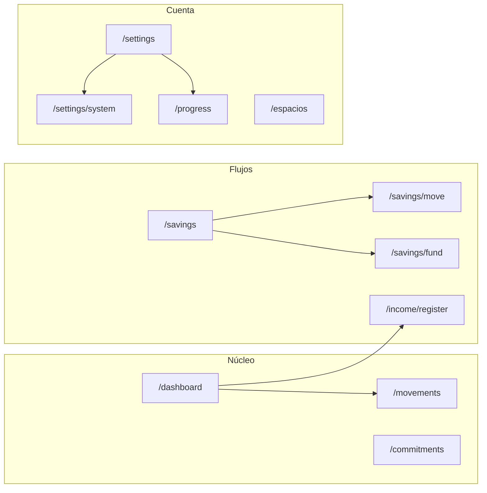

# QUIPU — Documento Maestro

> **Única fuente de verdad operativa del proyecto.** Si otro documento, comentario o
> conversación contradice este archivo, **gana este archivo** (o se actualiza
> explícitamente con fecha y motivo en el changelog del final).
>
> **Versión:** 1.0 · **Fecha:** 2026-07-26 · **Producto:** Quipu v2 (código v2.5, diseño v3.0)
>
> Este documento absorbe y reemplaza: `docs/quipu.md`, `docs/arquitectura.md`,
> `docs/quipu-design.md`, `docs/color-map-quipu2.md`, `docs/auth-smoke.md` y
> `docs/superpowers/plans/2026-07-08-v25-pending-work.md` (ver §10).

---

## 1. Cómo usar este documento

**Audiencia:** cualquier persona o agente de IA que toque el proyecto. Leyendo solo
este archivo debes poder entender qué es Quipu, cómo se ve, cómo está construido,
cómo se escribe código aquí y qué falta por construir.

**Mapa de secciones:**

| Sección | Qué responde |
|---|---|
| §2 El producto | ¿Qué es Quipu, para qué existe, para quién, qué no hace? |
| §3 Diseño | ¿Cómo se ve y se siente? Sistema visual completo y estado de los 9 bloques. |
| §4 Arquitectura | ¿Cómo se organiza el código y por qué? |
| §5 Backend y dominio | ¿Qué datos existen y qué reglas los gobiernan? |
| §6 Estándares de código | ¿Cómo se escribe código en este repo? |
| §7 Flujo de trabajo con IA | ¿Qué skills y herramientas se usan y cuándo? |
| §8 Estado y roadmap | ¿Qué existe hoy, qué falta, qué sigue? |
| §9 Operación | ¿Cómo se corre, se prueba y se despliega? |
| §10 Referencias | ¿Qué documentos vivos quedan fuera de este archivo? |

**Documentos vivos que NO están en este maestro** (siguen existiendo por separado):

- `docs/nextjs_knowledge.md` — referencia profunda de Next.js 16 (modelo mental RSC, caché, PPR).
- `docs/manuales-de-sistema.md` — 6 system prompts de rigor (seguridad, interrogador, abogado del diablo, RCA, refactor, CI/CD). Su uso se describe en §7.4.
- `docs/superpowers/` — histórico de planes y specs ejecutados. No se edita, se consulta.
- `quipu-2.html` — canvas visual oficial del diseño (fuente renderizable de §3).

**Regla de actualización:** cuando una decisión cambie, se edita ESTE archivo con la
decisión nueva y una línea en el changelog. No se crean documentos paralelos.

---

## 2. El producto

### 2.1 Qué es Quipu

Quipu es un **sistema de disciplina financiera personal** para el mercado peruano.
Inspirado en los quipus incas: divide el dinero **antes** de gastarlo, no después.

- **Tagline producto:** "Tu sueldo, con disciplina."
- **Tagline landing:** "Sabe si puedes gastar, en segundos."
- **Moneda:** mercados PEN / EUR / USD elegidos en onboarding (fija después). **Idioma:** español.

La promesa: **dar claridad sobre cuánto dinero puedes usar sin poner en riesgo tu
estabilidad.** Quipu no registra gastos para hacer gráficos; existe para responder:

> **"¿Cuánto puedo gastar hoy sin destruir mi mes?"**

### 2.2 Para quién es

Personas cuyo dinero entra de forma imperfecta. Tres perfiles:

| Perfil | Realidad | `incomeModel` |
|---|---|---|
| **Planilla** (dependiente) | Ingreso predecible, fechas conocidas (ej. 15 y 30) | `fixed` |
| **Independiente** | Ingresos variables, sin fechas fijas (freelance, ventas) | `variable` |
| **Mixto** | Parte estable + parte variable | `mixed` |

### 2.3 El problema real

Las apps financieras tradicionales asumen que el usuario sabe cuánto gana, cobra
siempre el mismo día y tiene disciplina para administrar decenas de categorías. En
Perú eso no es la realidad. El problema no es gastar de más: es la **incertidumbre**
("¿me alcanza?", "¿puedo comprar esto?"). Quipu convierte incertidumbre en reglas simples.

### 2.4 Qué SÍ hace y qué NO hace

**SÍ:** registra dinero que realmente entró, registra gastos, divide automáticamente,
calcula disponibilidad, organiza compromisos, mantiene objetivos de ahorro, detecta
comportamientos peligrosos, recomienda acciones, construye hábitos.

**NO (decisiones, no omisiones):**

- No pide estados financieros, patrimonio, sueldo exacto ni veinte categorías.
- No conecta con bancos en v2.5 (registro manual por diseño); sync bancaria y email inbound
  son parte del roadmap premium (Fases 2–4, §8.6). No hace contabilidad, no invierte, no calcula
  impuestos, no gestiona tarjetas.
- Sin chat (el coach es declarativo, nunca conversacional), sin OCR en v2.5, sin push en v2.5,
  sin OAuth social, sin multi-idioma, sin ML opaco (el coach sigue declarativo,
  §2.5 regla 8), sin leaderboards. Moneda del ledger: un mercado (PEN/EUR/USD) elegido en
  onboarding y fija después — no conversión FX ni multi-moneda en el mismo ledger. Export
  Excel/PDF y detección OCR desde email/PDF son parte del roadmap premium (Fases 2–3, §8.6).
  Sin confeti ni infantilismo.

**Quipu Plus no vende como beneficio comercial:** experimentos/betas, «IA» como feature por sí
sola, bloqueos agresivos de compras, automatizaciones que tomen decisiones financieras
importantes sin que el usuario las haya definido, ni integraciones sin necesidad clara.
El coach sigue sugiriendo; la confirmación es la regla. Una regla de automatización en Ajustes
cuenta como opt-in del usuario (§2.5 regla 8), no como promesa de «sin confirmar».

**Excepción v2.5 (informe anual):** en `/progress/rewards` la recompensa «Informe anual» es **solo UI**
(preview / copy gamificado); la generación y descarga PDF queda para **v2.6**. No abre export masivo
ni contabilidad — alinea con la pregunta filtro si el usuario ya cerró ciclos.

**Modo Pareja (Quipu Plus — v1, 2026-08-07):** presupuesto compartido para parejas. El **owner Premium**
crea un espacio (máx. 1); invita a un segundo miembro (Free permitido). Ciclo, sobres y gastos del
espacio son **dominio paralelo** al personal — no comparten filas. Participación = aportes explícitos +
gastos pagados con bolsillo personal (`personal_pocket`); sin deudas tipo Splitwise. Fuera de v1:
coach en espacio, ingresos del espacio, export completo del espacio, grupos >2.
Ver §5.6.

**La pregunta filtro** — antes de agregar cualquier tabla, pantalla, métrica o feature:

> "¿Esto ayuda al usuario a tomar una mejor decisión con el próximo sol que entre?"

Si no, no pertenece a Quipu.

### 2.5 Filosofía central

1. **Disciplina ≠ austeridad.** Disciplina es saber cuánto tienes, cuánto puedes gastar
   y qué compromisos cubrir; decidir antes del impulso. La app no restringe: elimina ansiedad.
2. **Quipu no trabaja con salarios; trabaja con eventos.** Nunca pregunta "¿cuánto ganas?".
   Pregunta "¿cuánto dinero entró?". **No modela nómina** (boletas, deducciones, AFP, proyecciones).
   Opcionalmente el usuario **etiqueta** ingresos de planilla peruana (gratificación, CTS, bono,
   utilidades) para que Quipu **sugiera** un reparto sin tocar su 50/30/20 global — sigue siendo
   un solo `incomeEvent` (ver §5.3). No hay totales separados "sueldo vs extraordinario" en el ciclo.
3. **Tres sobres, nada más:**
   - **Necesidades** — "¿qué necesito para sobrevivir este ciclo?" (alquiler, comida, transporte, servicios).
   - **Gustos** — "¿qué puedo disfrutar sin culpa?" (salidas, compras, caprichos).
   - **Ahorro** — "¿cómo protejo mi yo del futuro?" (fondo de emergencia, metas).
4. **Regla 50/30/20 como herramienta psicológica**, no económica: elimina fatiga de
   decisión y parálisis. Se sacrifica precisión extrema por constancia. Es ajustable por el usuario.
5. **Ciclos, no meses.** Un ciclo es la ventana durante la cual el dinero debe sobrevivir
   (ej. quincena, 30 días desde el pago). No es un mes calendario.
6. **Compromisos fijos viven en el calendario** (`dueDay`: alquiler día 5, Netflix día 18).
   Quipu no pregunta "¿con qué sueldo lo pagarás?" sino "¿ya tienes suficiente para cubrirlo?"
   **Cubierto** (reserva vía cascada) y **Pagado** (confirmación del usuario en el ciclo) son
   señales distintas; marcar como pagado no mueve sobres (P3-7).
7. **La métrica principal es disponibilidad diaria:** `remainingAmount / daysRemaining`
   → "Te quedan S/ 42 por día". Es una brújula, no un presupuesto rígido.
   **Presentación (canon v3.1):** el héroe se etiqueta **"Tu ritmo diario"** (unidad explícita,
   nunca un saldo) y su hint muestra la tasa + saldo + horizonte (`buildDailyRateCopy`):
   "≈ S/ 47.98 por día. Te quedan S/ 1,919 en sobres para 39 días." Al registrar un gasto,
   la confirmación muestra cómo amortiza: `computeDailyImpact` (convex/lib/spendableBalance.ts)
   + `buildDailyImpactLine` (por app). El gasto grande visible → drop visible y explicado.
8. **El coach sugiere, nunca aplica.** Detecta gastos acelerados, riesgos y desbalances;
   propone acciones (congelar sobre, transferencia de rescate). Toda acción requiere
   confirmación explícita del usuario (doble opt-in). **Excepción premium:** una regla de
   automatizaciones configurada por el usuario en Ajustes vale como opt-in: al registrar el
   ingreso correspondiente, Quipu Plus aplica el destino sin volver a preguntar.
9. **Gamificación para reforzar hábitos, no para entretener.** La racha cuenta ciclos
   consecutivos en orden. Si se rompe: no desaparece, no castiga, no humilla. La
   disciplina no se reinicia; se reconstruye.
10. **Facts over derivations:** se persisten hechos (gastos, ingresos, fechas,
    distribuciones aplicadas) y se calculan derivados (cobertura, disponibilidad,
    alertas). **Si un dato puede derivarse, no se guarda.** Excepciones deliberadas:
    `distributionApplied` (verdad histórica, nunca se recalcula) y `totalIncomeReceived`
    (snapshot materializado mantenido por `createIncomeEvent`).

### 2.6 Filosofía visual

Quipu no debe parecer un ERP, una hoja de Excel, un banco ni una startup genérica.
Debe sentirse cercano, maduro, claro, tranquilo y humano. La emoción objetivo es
**"Entiendo mi dinero"**, no "estoy administrando una empresa".

---

## 3. Diseño

> **Canon visual y de interacción.** Fuente renderizable: `quipu-2.html` (raíz del repo),
> canvas con los 9 bloques en web y móvil + theme switcher funcional.
> **Si algo de UI no está aquí o en el HTML, no existe.**

### 3.0 Resumen ejecutivo

| Dato | Valor |
|---|---|
| Regla madre | **Cada pantalla responde una sola pregunta.** |
| Validación de UX (tríada) | ¿Tranquilo? · ¿En control? · ¿Por buen camino? |
| Color oficial | **Verde musgo `#3C7D6E`** (`--qpA`); alternativo azul `#41648A` |
| Estados del Coach | tranquilo · advertencia · sugerencia · crisis |
| Orden de implementación | Web primero → su equivalente móvil, bloque por bloque |
| Personalización | Desbloqueable por constancia en ciclos, no por compra |
| Plan comercial | Quipu Plus mensual/anual (precios por mercado; Polar multi-currency). Checkout + portal; webhooks → `profiles.plan`. |

**Tres cosas que este sistema nunca es:** un juego (sin confeti/trofeos), un chat
(coach declarativo), un extractor (sin sync bancaria; registro manual).

### 3.1 Principios visuales

1. **Una pregunta por pantalla.** Si obliga a leer más de un encabezado, se parte.
2. **Primero tranquilidad, después optimización.** Ninguna pantalla introduce fricción sin dar calma antes.
3. **El Fondo de Emergencia siempre manda.** En jerarquía, el fondo va arriba; nunca compite con "logros".
4. **Elegante antes que lindo.** Cero emojis, cero decoración gratuita.
5. **Espacio en lugar de borde.** Se separa con espacio en blanco, no con líneas.
6. **El acento hace una sola cosa:** "todo va bien" y CTA principal. Nada más.
7. **Categoría extraordinaria (dorado):** ingresos etiquetados de planilla usan tokens
   `--extraordinary-*` (ver §3.3). Es **semántica de tipo**, no un segundo acento de CTA.

### 3.2 Tipografía

Tres familias, cada una con un rol. **No se mezclan.**

| Familia | Rol | Pesos | Casos |
|---|---|---|---|
| **Newsreader** (serif) | Momentos humanos, cifras, titulares | 400/500/600 italic | `<h1>`–`<h3>`, números grandes (S/ 82.50), frases hero |
| **Hanken Grotesk** (sans) | Interfaz, cuerpo, etiquetas | 400–700 | Body, botones (600), inputs, listas |
| **Geist Mono** (mono) | Micro-etiquetas técnicas | 400/500 | Labels uppercase ("DISPONIBLE HOY"), validación, system status |

**Reglas:**
- Una pantalla usa Newsreader para, como mucho, **un titular** y **una cifra grande**. No ambos compitiendo.
- Cifras ≥32px **siempre** Newsreader (los decimales en Newsreader son la firma del sistema).
- Label de 10–11px en mayúsculas con letter-spacing ≥0.1em → Geist Mono. Si dudas, mono.
- Body nunca < 13.5px web / 12.5px móvil.

**Escala web:** Display 64 · Hero 47 · H2 27–33 · H3 21–24 · Body 14.5–15 · Small 12.5–13.5 · Micro 10.5–11 (mono).
**Móvil:** mismos roles, h1/h2 y body × 0.85 aprox.; mono igual.

### 3.3 Color

**Neutros** (fijos, no cambian con el acento):

| Token | Hex | Uso |
|---|---|---|
| `--bg` | `#FBFAF7` | Background canvas |
| `--surface` | `#FFFFFF` | Cards, inputs, modales |
| `--surface-soft` | `#FDFCFA` | Inputs default |
| `--surface-warm` | `#F6F4F0` | Top bar, sidebar bg, hero soft |
| `--text-strong` | `#23201C` | Títulos, cifras; también bg de botón primario y FAB |
| `--text` | `#5A554E` | Body principal, labels de form |
| `--text-mute` | `#7C766D` | Subtítulos, captions |
| `--text-faint` | `#A6A099` | Placeholders, micro-copy, nav inactive |
| `--border` | `#E1DCD4` | Bordes sutiles, inputs, botón secundario |
| `--border-strong` | `#E7E3DC` | Cards |
| `--divider` | `#EFEBE4` | Divisores internos |

Otros neutros del HTML: página canvas `#EDEAE4`, dashboard main `#FCFBF9`, info boxes `#FAF8F5`,
stepper/keypad `#F4F2ED`, skeletons `#EEEAE3`/`#E4DFD7`, texto itálico/fechas `#8A847B`,
micro `#B0AAA1`, bordes extra `#ECE8E1`/`#EAE5DE`/`#F0ECE5`/`#F3EFE9`/`#E0DBD3`/`#DAD5CC`/`#D8D3CB`(dashed)/`#CFC9BF`(numeración).

**Acento oficial — verde.** Escala completa del theme switcher (`--qpA` controla los 31 tokens; **nunca se hardcodea ninguno en componentes**):

| Token | Verde (default) | Azul | Uso |
|---|---|---|---|
| `--qpA` | `#3C7D6E` | `#41648A` | Principal, CTA, checks, éxito |
| `--qpB` | `#2C5D52` | `#33506F` | Texto acento, links, ícono active |
| `--qpC` | `#5A6B62` | `#59667A` | Texto muted-accent |
| `--qpSoft` | `#5E8C79` | `#6B87AB` | Gradiente hero fondo (= Ahorro) |
| `--qpD` | `#B8C4B0` | `#B4BFD1` | Pale accent, dot decorativo |
| `--qp01` | `#E9F0EC` | `#E8EDF4` | Surface claro, badges, chips done |
| `--qp02` | `#D5E4DC` | `#D4DEEB` | Borde positivo |
| `--qp03` | `#E4EEE8` | `#E3E9F2` | Avatar bg |
| `--qp04` | `#EEF3F0` | `#ECF0F6` | Sidebar/nav active bg |
| `--qp05` | `#F1F6F2` | `#F0F4F9` | Seleccionado, landing bg, focus ring |
| `--qp06` | `#F2F7F3` | `#F1F5FA` | Hero gradient start |
| `--qp07` / `--qp08` | `#EFF5F1` / `#F9FBF9` | `#EEF2F8` / `#F9FAFC` | Coach gradient |
| `--qp09` | `#EEF5F0` | `#EDF2F8` | Fondo pantallas de éxito |
| `--qp10` | `#F3F8F5` | `#F2F5FA` | Fondo detalle gradient |
| `--qp11` | `#EEF4F0` | `#EDF1F7` | Login panel gradient |
| `--qp12`/`--qp13`/`--qp14` | `#EAF1EC`/`#DCE9E2`/`#D0E0D7` | `#E9EEF5`/`#DAE3F0`/`#CEDAEA` | Passkey icon box |
| `--qp15` | `#CFE0D7` | `#CDDAEA` | Borde dashed acento, botón coach |
| `--qp16` | `#DCE7E0` | `#DAE2EF` | Divider hero |
| `--qp17` | `#E1EAE4` | `#DFE7F1` | Track días restantes |
| `--qp18` | `#DDE8E1` | `#DBE4F0` | Track fondo hero |
| `--qp19` | `#D8E8DF` | `#D6E1F0` | Glow decorativo |
| `--qp20`/`--qp21`/`--qp22` | `#EAF2ED`/`#F7FAF8`/`#CBDDD3` | `#E9EFF6`/`#F6F8FB`/`#C9D6E8` | Fondo emergencia hero |
| `--qp23` | `#DCEAE2` | `#DAE5F1` | Badge "Prioridad" |
| `--qp24` | `#E4EAE5` | `#E2E7F0` | Track detalle fondo |
| `--qp25` | `#DEEAE2` | `#DCE5F1` | Track ahorro (preview ingresos) |
| `--qpS5` / `--qpS7` | `rgba(60,125,110,.5/.7)` | `rgba(65,100,138,.5/.7)` | Sombras de acento |

**Sobres** (fijos, no cambian con el acento):

| Sobre | Hex | Texto | Bg / Borde | Track |
|---|---|---|---|---|
| Necesidades | `#6E7C99` | `#4C5A78` (muted `#8A93A8`) | `#EEF0F5` / `#DCE1EC` | `#E4E8F0` |
| Gustos | `#A6836A` | `#8A6A4E` | `#F2EDE7`·`#F7F2EC` / `#E7D9C8` | `#EEE6DC` |
| Ahorro | `#5E8C79` | `--qpB` | `#E9F1EC` / `--qp02` | `--qp25` |

Extras: badge "Sugerido" bg `#EEE1D2`; luz compromisos `#B7C0D0`; tag "auto" `#A88C6E`.

**Estados cromáticos** (sobrios, nunca agresivos):

| Estado | Color | Background | Border | Text |
|---|---|---|---|---|
| Positivo / éxito | `--qpA` | `--qp01` | `--qp02` | `--qpB` |
| Advertencia (ámbar) | `#C99A3E` | `#F8F1E0` | `#EAD9AE` | `#7A5A1E` |
| Crisis / error (terracota) | `#B0685A` | `#F6EBE7` / `#F8ECE8` | `#E6C9C1` / `#E0BBB0` | `#7C4033` / `#95584B` |
| Info / coach tranquilo | `--qpA` | gradient `--qp06`→`#FBFAF7` | `--qp16` | `--text` |

Input en error: bg `#FDF7F5`, borde 1.5px `#C98E80`, mensaje 12px `#B0685A`.

**Categoría extraordinaria (ingresos de planilla etiquetados):** capa semántica dorada; no sustituye al acento verde en CTAs.

| Token | Hex | Uso |
|---|---|---|
| `--extraordinary-a` | `#B08430` | Ícono, borde activo, check |
| `--extraordinary-b` | `#86651F` | Texto badge "Extraordinario" |
| `--extraordinary-surface` | `#F6EFDE` | Fondos suaves, cards tipo |
| `--extraordinary-border` | `#E8DABC` | Bordes |

**Reglas duras:**
- **No hay rojo brillante** (errores = terracota, nunca `#EF4444`).
- **No hay verde WhatsApp** (el verde de Quipu es musgo-sereno `#3C7D6E`).
- **El acento hace una sola cosa.** No decora.

### 3.4 Sombras, radios, espaciado

**Sombras (9 niveles):**

| Token | Valor | Uso |
|---|---|---|
| `--shadow-sm` | `0 1px 2px rgba(35,32,28,.03)` | Cards simples |
| `--shadow-md` | `0 2px 4px rgba(35,32,28,.05)` | Inputs, frames internos |
| `--shadow-lg` | `0 22px 55px -30px rgba(35,32,28,.4)` | Frame canvas web |
| `--shadow-xl` | `0 26px 60px -30px rgba(35,32,28,.42)` | Frame dashboard |
| `--shadow-modal` | `0 40px 90px -25px rgba(0,0,0,.5)` | Modal, FAB elevated |
| `--shadow-sheet` | `0 -20px 50px -20px rgba(0,0,0,.35)` | Bottom sheet móvil |
| `--shadow-glow` | `0 14px 34px -14px var(--qpS7)` | Botón primario, success ring |
| `--shadow-amber` | `0 8px 24px -14px rgba(120,90,30,.3)` | Card advertencia |
| `--shadow-crisis` | `0 16px 40px -18px rgba(176,104,90,.4)` | Card crisis |

Overlays: modal web `rgba(35,32,28,.34)`, móvil `rgba(35,32,28,.32)` + blur.

**Radios:** `r-xs` 6–7 (chips, kbd) · `r-sm` 9 (cards móvil) · `r-md` 11–12 (inputs, botones, cards) ·
`r-lg` 13–14 (cards web) · `r-xl` 16 (hero cards) · `r-2xl` 18 (dashboard hero) ·
`r-modal` 22 · `r-sheet` 24 (`24 24 38 38` top corners) · `r-frame` 38 · `r-shell` 46.
Un componente = un radio; no se anidan radios distintos sin jerarquía.

**Espaciado:** múltiplos de 4 (`4·8·12·16·20·24·32·40·48·56·60`). Móvil 12–22;
web 16–40 en cards y 28–40 en hero. Section gap: 12–14 web / 9–11 móvil.
Bordes 1px; 1.5px solo para seleccionado/error/crisis.

### 3.5 Componentes base

**Botones** (Hanken 600, 14–15px, radio 11; icono opcional a la izquierda, nunca a la derecha):

| Variante | Bg | Texto | Borde | Caso |
|---|---|---|---|---|
| Primary | `--text-strong` | `--bg` | — | CTA principal; 100% ancho en forms/modales |
| Secondary | `--surface` | `--text-strong` | 1px `--border` | "Atrás", acción secundaria |
| Ghost | transparent | `--text-mute` | — | "Ahora no", "Lo veo más tarde" |
| Positive | `--qpA` | `#FBFAF7` | — | Confirmación por defecto (ej. "Confirmar en Gustos") |
| Destructive | transparent | `#B0685A` | — | "Cerrar sesión" |
| Dashed-add | `--surface` | `--qpB` | 1.5px dashed `--qp15` | "+ Nueva meta", "+ Agregar passkey" |
| Disabled | `--surface-soft` | `--text-faint` | 1px `--border` | — |

**Inputs:** altura 46–48 web / 44–46 móvil, radio 11/12, bg `--surface-soft`, borde 1px `--border`;
focus = borde `--text` + ring `0 0 0 3px var(--qp05)`; **label siempre encima** (12.5px 500),
placeholder solo si el campo es obvio. Steppers: − / cifra Newsreader / +. Keypad 3×4
(registrar gasto): botones 48×48, Newsreader 19–21px, cifra central 40–46px sin separador de miles.

**Chips:** pill (radio 999). Default (`--surface`/`--border`/`--text-mute`) · Selected
(`--qp05` + 1.5px `--qpA` + `--qpB` 600) · Envelope por sobre (colores de §3.3) ·
badges "Sugerido" (`#EEE1D2`) y "Activo" (`--qp01`) · Locked (dashed `#D8D3CB`).

**Cards:** Standard (surface, radio 14, padding 17–22) · Hero positive (gradient `--qp06`→`#FBFAF7`,
radio 18) · Coach tranquilo (gradient `--qp07`→`--qp08`) · Fondo emergencia (gradient `--qp20`→`--qp21`,
borde `--qp22`, radio 20) · Advertencia (ámbar + `--shadow-amber`) · Crisis (terracota, borde 1.5px,
`--shadow-crisis`) · Dashed-disabled (logros/metas bloqueadas).
**Regla:** una card de crisis nunca es inline; ocupa fila entera y empuja al resto.

**Modal (web):** 400px max, radio 22, `--shadow-modal`; header título 15px 600 + X;
footer CTA 100%. Stepper de 3 dots 22×4. **Bottom sheet (móvil):** radio `24 24 38 38`,
drag handle 38×4, contenido detrás difuminado. Cierre: X, drag down o tap fuera — siempre las tres.

**Progreso:** bar de sobre (track 4–8px color sobre al 12%, fill 100%) · bar segmentada 50/30/20
(12–16px, 3 segmentos sin gap) · mini bar chart de 12 ciclos (gris `#E7E3DC` incompleto, `--qpA` completado).

**Status dots:** 6–9px — tranquilo `--qpA` · advertencia `#C99A3E` · crisis `#B0685A` ·
neutro `--qpD`. Pulso (`qpulse`) solo en loading, nunca en estado final.

**Achievement badge:** círculo 34–42px. Done (`--qp01`+`--qp02`+ícono `--qpA`) ·
Discoverable (dashed, ícono faint) · Locked (opacity .75).

**Sidebar (web):** 228px, bg `--surface-warm`, **7 ítems** + avatar al fondo (34px, `--qp03`, inicial serif):
Inicio · Registrar → `/income/register` · **Movimientos** · Ahorros · Compromisos · Espacios · Ajustes.
**Sin ítem Coach:** el bloque 7 vive embebido en `/dashboard` (canon bloque 7); el canvas `quipu-2.html` aún muestra Coach en sidebar — tratar como IA obsoleta, no producto.
Active: bg `--qp04` + 600. **Nav móvil:** header fijo (`AppMobileHeader`, 52px + safe-area, `z-30`) + **drawer lateral izquierdo** (`Sheet side=left`, ~288px / `w-72`, `z-50`) reutilizando `AppNavContent`; feedback en el drawer; sin bottom bar ni FAB central. Cierre del drawer: `onOpenChange`, `onNavigate` en links y `key={pathname}` en `AppMobileNav` — sin `useEffect` en pathname.

**Breadcrumbs (sub-rutas):** primitivo shadcn en `shared/components/ui/breadcrumb.tsx`; trail resuelto en `shared/lib/breadcrumbs.ts` y renderizado vía `AppBreadcrumb` dentro de `AppPageShell`. Estilo sutil: `text-[12.5px] text-mute`, separador `ChevronRight`, último segmento `text-ink-secondary font-medium` con `aria-current="page"`. Ocultos en home (`/dashboard`) y hubs de primer nivel del sidebar (`/savings`, `/settings`). Sub-rutas muestran trail (`Inicio > Ahorros > Mover sobrante`, etc.).

**Anchos de página (`AppPageShell`):**

| Tier | Tailwind | Cuándo |
|------|----------|--------|
| **narrow** | `max-w-2xl` | Sub-páginas, formularios, listas secundarias (movements, commitments, move surplus, register, espacios detail) |
| **medium** | `max-w-4xl` | Progreso, fondo de emergencia |
| **wide** | `max-w-6xl` | Dashboard, hub ahorros, hub ajustes |

Padding: tier `6xl` usa `px-4 md:px-8`; tiers `2xl`/`4xl` usan `px-5 py-6 md:px-0 md:py-8`. Overview wide: columna `flex flex-col gap-*`; grid solo en rejillas internas (p. ej. metas en `/savings`).

**Animaciones decorativas:** `qspin` (0.8s linear, spinner) y `qpulse` (1.4s ease-in-out, skeletons con stagger 0.2s). Transiciones de vista (detalle → formulario, paso N → N+1): ver **§3.10 Motion**.

### 3.6 Estados transversales

Toda pantalla crítica tiene 4 estados (+1 futuro):

1. **Vacío:** ícono suave (<200px, nunca "triste") + titular Newsreader 25–29 + subtítulo mute + 1 CTA.
   Máximo 3 líneas de copy. Si es la primera interacción del usuario, un solo CTA.
2. **Loading:** spinner 38–46px (borde 3px `--border` + top `--qpA`, `qspin`) + titular Newsreader 25 +
   3–4 skeleton bars. Copy: "Preparando tu espacio…" — **nunca "Cargando"**. >4s sin resolver = bug.
3. **Error:** card terracota 380–400px (`#F6EBE7`/`#E6C9C1`, radio 12), ícono `!` en círculo `#B0685A`,
   título 13.5px `#7C4033` + descripción `#95584B`. Siempre ofrece salida ("Intentar de nuevo" primary).
4. **Éxito:** check en círculo 70–88px bg `--qpA` + `--shadow-glow` + titular Newsreader 26–32.
   Con nombre propio solo cuando es transaccional ("Tu cuenta está lista"), nunca en rutina ("Gasto registrado").
   Siempre con CTA de salida.
5. **Confirmación destructiva (futuro, no implementado):** modal con border-top 4px `#B0685A`,
   secondary "No, cancelar" + destructive filled.

### 3.7 Los 9 bloques (con estado de implementación)

Cada bloque responde **una pregunta**. Estado al 2026-07-22 (auditado en código; delta en §8.4).

| # | Bloque | Pregunta | Estado |
|---|---|---|---|
| 1 | Autenticación | ¿Eres tú? | ✅ Implementado (canon redesign) |
| 2 | Onboarding | ¿Cómo se arma tu sistema? | ✅ Implementado (v3, 3 pasos) |
| 3 | Dashboard | ¿Voy bien? | ✅ Implementado (2026-07-21, P1-4); **Plus v1 (2026-07-29):** card Predicción + recordatorios in-app premium |
| 4 | Registrar gasto | ¿De qué sobre sale? | ✅ Implementado (2026-07-21, variantes A/B) |
| 5 | Ingresos | ¿Cuánto entró y a dónde va? | ✅ Implementado (habitual + extraordinario P2-7, 2026-07-22) |
| 6 | Ahorros | ¿Qué estoy construyendo? | ✅ Implementado (P1-9 + mover sobrante P2-7, 2026-07-22) |
| 7 | Coach | ¿Qué decisión debería tomar? | ✅ Implementado (2026-07-21, P1-10) |
| 8 | Gamificación | ¿Qué he logrado? | ✅ Implementado (2026-07-21, P1-11) |
| 9 | Perfil y ajustes | ¿Cómo funciona mi sistema? | ✅ MVP (2026-07-21, P1-12); **Polar billing (2026-07-22)** — sesiones/ciclo wizard/nombre edit diferidos; **Plus v1 (2026-07-29):** auto-aplicación de reglas extraordinarias (premium) |

**Bloque 1 — Autenticación "¿Eres tú?"**
Pantallas web: Landing · Login · Registro · Passkeys · Vacío · Error · Recuperación · Loading · Éxito
(móvil: falta Recuperación/Loading/Vacío en el HTML).
Decisiones: passkey primero, contraseña como respaldo; login web con panel lateral 400px
(gradient `--qp11`→`--qp03`) con tríada, sin cifras ficticias; "Ahora no, usar contraseña"
explícito en vez de "cancelar"; recuperación en tono humano. Sin magic link, OAuth ni SMS.

**Bloque 2 — Onboarding "¿Cómo se arma tu sistema?"**
3 pasos + resumen, mismo orden web/móvil. Paso 1 Perfil (3 cards: dependiente/independiente/mixto).
Paso 2 Sistema, **condicional al perfil** (única divergencia por dato en toda la app):
dependiente = mensual/quincenal + día de pago con live preview del ciclo; independiente = 15/30 días
+ info card; mixto = parte previsible (monto + día) + fuentes variables (chips). Paso 3 Reparto
50/30/20 con bar segmentada + steppers + validación inline ("Suma 100% · listo"). Siempre se
puede volver atrás. El paso 3 dice "Ahorro · Fondo de emergencia y metas", no "ahorro 20%".
Sin educación financiera, glosario, video ni tour: solo configuración.
(En el HTML móvil faltan Paso 2 Independiente y Mixto.)

**Bloque 3 — Dashboard "¿Voy bien?"**
5 niveles, misma jerarquía web y móvil, distinta densidad:
1. **Disponible hoy (hero):** cifra Newsreader 64 web / 34 móvil + etiqueta "Tu ritmo diario" +
   hint de tasa (≈ por día, saldo en sobres, días restantes) + validación inline + días restantes
   con progress + badge de estado.
   **El hero nunca cambia de posición ni de propósito.**
2. **Tus sobres:** 3 cards (orden fijo Necesidades·Gustos·Ahorro) con disponible/total + progress.
3. **Próximos compromisos:** lista con "en N días" + monto + status de cobertura y pago en header.
4. **Coach:** solo si tiene algo que decir (ver Bloque 7).
5. **Movimientos recientes:** 4 items + "Ver todo", ingresos en verde, gastos en dark.
Decisiones: "registrar" desde header (web) o FAB (móvil); **sin búsqueda, filtros ni tabs**
(el dashboard es una vista, no una herramienta); saldo negativo se muestra como "0.00" y el
coach sube a advertencia. Móvil: niveles 1–2 sin scroll en iPhone 14.

**Bloque 4 — Registrar gasto "¿De qué sobre sale?"**
Target **<10 segundos** end-to-end. 3 variantes, mismo backend:
A. FAB → keypad → sobre sugerido (highlighted, sobrescribible con un toque) → confirmación
   ("Te quedan S/ 322 en Gustos" + "Registrado en 8 segundos").
B. Desde tarjeta de sobre → modal directo con sobre preseleccionado, monto + concepto opcional.
C. Automático (gasto detectado) → card "auto" + "¿Está bien así?" + Sí/Cambiar sobre.
Decisiones: **concepto siempre opcional**; sin selector de fecha (asume hoy); sin adjuntos;
móvil = bottom sheets. Sin OCR, QR, bancos ni geolocalización.
(En el HTML móvil falta la Variante B.)

**Bloque 5 — Ingresos "¿Cuánto entró y a dónde va?"**
Solo manual. **Un solo** `/income/register`: toggle **Habitual / Extraordinario** (P2-7).
Habitual: web 2-col inputs (monto Newsreader 34 + origen en chips + fecha default hoy) y
**preview de impacto siempre visible** (3 sobres + nuevo disponible hoy); confirmación con deltas.
Extraordinario: grid de tipos (gratificación jul/dic, CTS, bono, utilidades, otro), regla sugerida
desde perfil (Ajustes → Automatizaciones), destino por evento (habitual / todo a ahorro; personalizar
por sobre diferido), preview incluye **Nuevo disponible hoy**, confirmación con capa dorada y badge
en movimientos. Decisiones: origen sigue siendo chip/enum backend; **todo ingreso se reparte** según
política confirmada (50/30/20 del perfil o override de ese evento); `distributionApplied` no se
recalcula; sin edición retroactiva en este flujo. Móvil: full-screen, no sheet.
Spec: `docs/superpowers/specs/2026-07-21-ingresos-extraordinarios-bloques-5-6-design.md`.

**Bloque 6 — Ahorros "¿Qué estoy construyendo?"**
**Un solo módulo** (`/savings`): stock (Fondo + metas) ≠ flujo del ciclo.
**El Fondo de Emergencia siempre hero** (fila entera, gradient `--qp20`→`--qp21`, badge "Prioridad",
cifra Newsreader 52, progress con 3 marks de meses, "1.2 de 3 meses cubiertos · vas seguro",
aporte automático por ciclo). **Otras metas** debajo del hero (grid 3-col, máx 6, "+ Nueva meta").
**Tu ahorro este ciclo** (6N, P2-7) va **después** de metas, card neutra (no segundo shield verde):
objetivo / adicional / total, barra sólida+rayada, CTA mover sobrante. El Fondo no se usa para
aportar a metas; el aporte a metas sale del sobre Ahorro libre del ciclo o de `/savings/move`.
Detalle del fondo (`/savings/fund`): gradiente página `--qp10`→canvas, 3 sub-cards + "Aportar ahora"
+ "Ajustar aporte". En dashboard, el sobre Ahorro muestra `allocatedAmount` (apartado del ciclo),
no el remanente tras mover al Fondo.
**Mover sobrante (6N-B/C):** `/savings/move` — TanStack Form + Zod (`move-surplus-form.tsx`): chips Desde
(Necesidades / Gustos / gratificación vía origen `extraordinary`), fila de monto + slider + pills, destino
en cards (Fondo recomendado u otra meta), banner verde “solo este ciclo”; **ruta normal** con nav + breadcrumb (`AppPageShell`, tier narrow) — ya no bottom sheet en móvil.
Tras mutación → `/savings/move/success` (6N-C) con snapshot en query params + breakdown del ciclo.
Sin metas compartidas, inversiones, cripto ni plazos.
Spec: misma ruta que Bloque 5 arriba.

**Bloque 7 — Coach "¿Qué decisión debería tomar?"**
Asistente **declarativo**; ocupa espacio proporcional a la gravedad:

| Estado | Tamaño | Color | Patrón | Acción |
|---|---|---|---|---|
| Tranquilo | Card pequeña en dashboard | gradient verde | "Vas por buen camino. Cierras el ciclo con S/ X de sobra." | "Ver detalle" / "Guardar de más" |
| Advertencia | Banner ámbar, fila propia | ámbar | "Tu ritmo de gastos es más alto de lo habitual. Todavía puedes ajustar." | "Ajustar ciclo" / "Ver en qué" |
| Sugerencia | Card, fila propia | gradient verde | "[Acción concreta]. ¿Lo hacemos?" | "Hacerlo" / "Ahora no" |
| Crisis | Hero, toma la pantalla | terracota | "Te faltan S/ X para cubrir tus compromisos. Resolvámoslo ahora en un paso." | 2 opciones explícitas + "Lo veo más tarde" |

Reglas duras: nunca más de 1 pregunta; sin historial conversacional; **no ruta ni ítem de nav propio**
(solo nivel 4 del dashboard; no `/coach`); no proactivo fuera del dashboard; copy de crisis directo, no dramático; en tranquilo es visible por defecto (refuerza orden);
no personaliza más allá del nombre. Sin chat, voz, historial ni ML visible.
(En el HTML móvil falta el estado Sugerencia.)

**Bloque 8 — Gamificación "¿Qué he logrado?"**
"Tu progreso": racha (cifra Newsreader 50 + "ciclos cerrados en orden" + bar chart de 12 ciclos) +
logros (grid, estados done/discoverable/locked; se ganan por hechos objetivos del sistema, no por
check-ins). "Recompensas": desbloqueables por racha — **Tema Tinta** (3 ciclos), **Acento Arcilla**
(6, UI sin selector activo), **Informe anual encuadernado** (12). Sin picker de acento ni ícono de
app; el tema claro/oscuro se controla en Ajustes → sistema → Preferencias (`next-themes`).
**La unidad de progreso es el ciclo**, no el día ni el punto. Sin puntos, monedas, leaderboard,
XP, niveles ni badges de monto.

**Bloque 9 — Perfil y ajustes "¿Cómo funciona mi sistema?"**
Cuenta y sistema en **rutas separadas** (canon web `/settings` + `/settings/system`; móvil hub en
`/settings` con listas Cuenta/Sistema):
Cuenta = perfil (avatar, nombre, tags) + **plan y suscripción siempre visibles** (Quipu Plus
Quipu Plus según mercado — p. ej. S/ 14.90/mes o S/ 119.90/año en Perú —, estado, renovación) + seguridad (passkeys por dispositivo, "+ Agregar passkey",
sesiones activas, "Cerrar todas"). Sistema = porcentajes (preview + "Ajustar reparto") + ciclo
(tipo/inicio/perfil + "Cambiar ciclo") + compromisos fijos (lista + total por ciclo + "+ Agregar")
+ preferencias (moneda del perfil PEN/EUR/USD read-only · idioma ES, **tema claro/oscuro**, toggles de resumen diario
y alertas) + **automatizaciones** (reglas de ingresos extraordinarios).
"Cerrar sesión" es un item de lista (acción deliberada). **No hay "Eliminar cuenta" en v2.5.**

### 3.8 Microcopy

**Tono:** humano, no transaccional ("Tu sistema está listo, Carlos", no "Configuración completada");
tranquilizador antes que informativo (primera línea calma, segunda explica); cero jerga financiera
("sobre", no "categoría presupuestaria"); tuteo; español peruano; cero superlativos.

**Patrones:**

| Situación | Patrón | Ejemplo |
|---|---|---|
| Éxito | `[Acción] + [dato relevante]` | "Gasto registrado. Te quedan S/ 322 en Gustos este ciclo." |
| Validación | `Vas [verbo]. [Proyección]` | "Vas por buen camino. Cierras el ciclo con S/ 240 de sobra." |
| Error | `[Qué pasó]. [Qué hacer]` | "No pudimos iniciar sesión. Revisa tu correo e intenta de nuevo." |
| Loading | `[Verbo presente, amable]` | "Preparando tu espacio…" |
| Sugerencia coach | `[Acción]. [Por qué]` | "Mueve S/ 120 de Gustos a Necesidades y llegas tranquilo." |
| Crisis | `[Hecho]. [Resolvámoslo en X]` | "Te faltan S/ 180. Resolvámoslo ahora en un paso." |
| Decisión blanda | infinitivo / "Hacerlo" | "Hacerlo" · "Ahora no" · "Lo veo más tarde" |
| Tiempo | `En N segundos` | "Registrado en 8 segundos" |

**Palabras prohibidas:** cancelar (→ "ahora no", "volver"), sí (→ "hacerlo"), error (→ "no pudimos"),
click aquí (→ "toca", "abre"), login (→ "iniciar sesión"), submit (→ "continuar", "registrar"),
usuario (→ "tú"), presupuesto (→ "sistema", "sobre"), categoría (→ "sobre"), transacción
(→ "gasto", "ingreso", "movimiento"), "¡Importante!", superlativos de marketing.

**Tríada de validación:** toda pantalla positiva responde ¿Tranquilo? ("Todo sigue en orden") +
¿En control? ("Puedes gastar S/ 82.50 hoy") + ¿Por buen camino? ("Cierras con S/ 240 de sobra").
Si falta una, la pantalla está incompleta.

### 3.9 Lo que falta diseñar (gaps del propio HTML)

- Móvil: Recuperación/Loading/Vacío (B1), Paso 2 Independiente y Mixto (B2), Variante B de gasto (B4), coach Sugerencia (B7).
- Web: dashboard en estados no-positivos (vacío/crisis solo se ilustran en B7).
- Modal de confirmación destructiva (diseñado en spec, no implementado).
- Theme switcher a CSS variables y componentes codificados como sistema (no existe Storybook).

### 3.10 Motion (transiciones UI)

> Sobrio y funcional: suaviza cambios de intención (detalle → editar, formulario → éxito, paso de wizard), no decoración. CSS + `tw-animate-css` ya en el stack; **sin** Framer Motion ni librerías nuevas.

**Principios**

1. **Suave, no espectacular:** fade + slide vertical de 4–8px (o horizontal en drawer). Evitar zoom en contenido interno.
2. **Overlays alineados:** Sheet, Dialog, Popover y AlertDialog ~**200ms** entrada; salida ~**150ms**.
3. **`prefers-reduced-motion`:** obligatorio. Con preferencia activa, swap instantáneo — misma información, mismo foco, sin animación perceptible.
4. **Teclado:** al cambiar paso/vista, el primer Tab cae en el primer campo editable (monto, descripción, etc.) o en el título anunciable (`tabIndex={-1}` + `aria-live="polite"` en títulos de paso).
5. **No bloquear:** animaciones CSS puras; la UI debe ser interactiva en cuanto el contenido está montado.

**Tokens** (`app/globals.css`, `@theme`):

| Token | Valor | Uso |
|---|---|---|
| `--duration-motion-fast` | `150ms` | Salida, crossfades cortos |
| `--duration-motion-normal` | `200ms` | Entrada estándar (overlays, `AnimatedView`) |
| `--duration-motion-slow` | `280ms` | Solo hero/éxito ocasional |
| `--ease-motion-enter` | `cubic-bezier(0.16, 1, 0.3, 1)` | ease-out suave |
| `--ease-motion-exit` | `cubic-bezier(0.4, 0, 1, 1)` | ease-in |

Utilidades opcionales: `.qp-motion-enter` / `.qp-motion-exit` (combinan `animate-in`, `fade-in-0`, slide leve + `motion-reduce:animate-none motion-reduce:transition-none`).

**Cuándo usar `AnimatedView`**

Primitivo compartido: `shared/components/ui/animated-view.tsx`.

| Caso | Patrón |
|---|---|
| Máquina de estados dentro de Sheet/Dialog (p. ej. detalle ↔ editar ↔ confirmar) | `<AnimatedView viewKey={state} direction="forward\|back">` envuelve el cuerpo; el shell del overlay ya anima apertura/cierre |
| Wizard multi-paso (onboarding, auth, ciclo) | `viewKey={step}`; `direction="back"` en botón Atrás |
| Formulario → pantalla de éxito | `viewKey="success"` + fade; check con `motion-safe:` si aplica |

API mínima: `viewKey` (remount → entrada), `direction` (`forward` \| `back`), `role="region"`, `aria-live="polite"` opcional, ref para focus al montar.

**Regla reduced-motion (WCAG 2.3.3)**

En overlay content y `AnimatedView`:

```html
class="… motion-reduce:animate-none motion-reduce:transition-none"
```

Verificación manual: DevTools → Rendering → *Emulate CSS media feature `prefers-reduced-motion: reduce`*.

**Fuera de alcance:** transiciones entre rutas Next (View Transitions API), Lottie/confeti, spinners globales `qspin` salvo auth/loading local.

---

## 4. Arquitectura técnica

> Documento constitucional técnico. Si una decisión contradice esta sección, gana esta
> sección (o se actualiza explícitamente).

### 4.1 Origen

Quipu v2 nace del aprendizaje de v1, que aplicó `cacheComponents`/PPR sin entender el modelo
mental y terminó rígido y sin UI usable. v2 invierte el orden: **primero arquitectura conceptual,
después implementación**. La UI se construye módulo por módulo sobre cimientos explícitos.

### 4.2 Principios rectores

1. **Toda la lógica vive en Convex.** El cliente es presentación + orquestación. Si una regla
   de negocio puede ir en una `mutation`/`query`, va ahí.
2. **Server-first.** Server Component por defecto; `'use client'` solo con estado, eventos,
   APIs de browser o `useQuery` de Convex. Boundary lo más abajo posible.
3. **Feature First, máximo 2 niveles** bajo `modules/[x]/`.
4. **Tipos generados, no inventados.** `Doc`/`Id` de `convex/_generated/dataModel`; view models
   derivados con `Pick`/`Omit`. Prohibido duplicar a mano.
5. **Errores tipados, no strings.** Backend lanza `ConvexError({ code, message })`; el cliente
   discrimina por `error.code`. Nunca comparar `error.message` con strings.
6. **Mobile-first, accesible por defecto.** Diseño para 375px primero; a11y es restricción desde el sketch.

### 4.3 Stack confirmado

| Capa | Tecnología | Razón |
|---|---|---|
| Framework | Next.js 16.2 (App Router) | RSC, streaming, layouts anidados |
| UI runtime | React 19.2 | `use()`, View Transitions |
| Bundler | Turbopack | Default en v16, sin config |
| Optimización | React Compiler (`reactCompiler: true`) | Cubre memo/useMemo/useCallback manual |
| Backend/DB | Convex 1.42 | Queries reactivas, mutations transaccionales |
| Auth | Better Auth + passkey | Sin passwords para el usuario |
| Forms | TanStack Form + Zod | Type-safe, SSR-friendly |
| UI primitives | shadcn/ui sobre Base UI | Accesibles |
| Styling | Tailwind v4 | Sin config legacy |
| Lint/format | Biome 2.5 | No se discute estilo con él |
| Tests | Vitest 4 + Testing Library | TDD donde aplique |

### 4.4 Estructura de carpetas

```
app-quipu/
├── app/          → Routing Next.js (sin lógica de negocio; composición pura)
├── auth/         → Better Auth: client, server, helpers de sesión
├── convex/       → Backend: schema, queries, mutations, lógica de negocio
├── core/         → Infra transversal: env.ts, errors/, constants.ts
├── shared/       → UI primitives (shadcn), helpers (money, date), layout reusable
├── modules/      → Un directorio por dominio funcional
├── hooks/        → Hooks globales (solo si los usan 2+ módulos)
└── docs/         → Este documento + referencias
```

| Capa | Puede importar desde | Nunca contiene |
|---|---|---|
| `app/` | `modules/`, `shared/`, `auth/`, `core/` | Lógica de negocio, acceso a datos |
| `auth/` | `core/` | Lógica de dominio |
| `convex/` | `core/`, `convex/lib/` | UI, lógica de cliente |
| `core/` | (nada del sistema) | UI, dominio |
| `shared/` | `core/` | Lógica de un dominio específico |
| `modules/[x]/` | `convex/_generated/` (tipos), `shared/`, `core/`, `auth/` | Acceso directo a Convex desde UI |
| `hooks/` | `shared/`, `core/` | Lógica de dominio |

**Nunca:** `core/` no importa de `modules/` ni `shared/`; `shared/` no importa de `modules/`;
`modules/[x]/` no importa de `modules/[y]/` (lógica compartida sube a `shared/` o `core/`).

**Estructura interna de módulo (todos igual):**

```
modules/[x]/
├── components/    Componentes React del dominio
├── actions.ts     Wrappers tipados sobre mutations Convex ("use server")
├── queries.ts     Wrappers tipados sobre queries Convex
├── schemas.ts     Zod schemas de inputs y payloads
├── types.ts       View models / DTOs del cliente
├── constants.ts   Constantes del módulo
├── lib/           Funciones puras del dominio (opcional, con tests)
└── hooks/         Hooks de orquestación del módulo (opcional)
```

**Regla de oro del 2-niveles:**
✅ `modules/onboarding/components/step-3-allocation.tsx`
❌ `modules/onboarding/components/forms/step-3.tsx`
❌ `modules/onboarding/components/wizard/amount-field.tsx`
Si aparece un tercer nivel: reusable → `shared/`; complejo → partir el padre; otro dominio → su módulo.

**No hay `repositories/` ni `services/`** (patrón del demo con Drizzle): Convex absorbe ambas
capas. El módulo del cliente es delgado: presentación + orquestación + validación Zod.

### 4.5 Reglas de comunicación con Convex

**Toda mutation/query se invoca desde un wrapper del módulo** (centraliza tipado, args y errores;
la UI nunca importa `convex/*` directamente):

```ts
// modules/onboarding/actions.ts
"use server";
import { fetchAuthMutation } from "@/auth/auth-server";
import { api } from "@/convex/_generated/api";
import { fromConvexError } from "@/core/errors";
import { completeOnboardingSchema } from "./schemas";

export async function completeOnboardingAction(input: unknown) {
  const parsed = completeOnboardingSchema.parse(input);
  try {
    return await fetchAuthMutation(api.profiles.createProfile, parsed);
  } catch (error) {
    throw fromConvexError(error);
  }
}
```

**Errores semánticos:** el backend lanza `ConvexError({ code, message })` con códigos del enum
`ErrorCode` en `core/errors/index.ts`; el cliente usa `fromConvexError()` y discrimina por
`error.code`. `fetchAuthMutation` **tira excepción**, no retorna `result.ok` — siempre try/catch.

**Type-safety end-to-end:** `Id<"profiles">`, `Doc<"profiles">` vienen de
`convex/_generated/dataModel`. View models se derivan (`Doc<"envelopes"> & { percentRemaining: number }`).

### 4.6 Reglas de Next.js 16 aplicadas

| Decisión | Estado | Razón |
|---|---|---|
| `cacheComponents: true` | **NO activado** | v1 lo quemó; datos 100% por usuario, nada cacheable entre usuarios aún. Se activa con 3+ fetches compartidos. Candidatos se marcan `// TODO(cacheComponents):` |
| `reactCompiler: true` | Activado | Confiar en él; no `memo`/`useMemo`/`useCallback` manual salvo profiler |
| `loading.tsx` global | **No usar** | Bloquea LCP. `<Suspense>` con skeleton por sección |
| Server Actions | Solo cuando Convex no resuelva | Default: mutation Convex desde cliente. Server Action solo si se necesita redirect nativo, cookie write o progressive enhancement |
| Multi-moneda ledger | Parcial | Onboarding: PEN/EUR/USD fijos; Polar cobro multi-currency en 2 productos |
| Tipos duplicados | Prohibido | Derivar de `dataModel` |

**Árbol de decisión por componente:** ¿estado/efectos/eventos/APIs browser? → `'use client'`.
¿Form con TanStack Form? → `'use client'`. ¿`useQuery` de Convex? → `'use client'`.
Si no → Server Component. Los Client Components pueden recibir Server Components como
`children`/`props` sin meterlos al bundle.

**Streaming:** skeletons por sección dentro de `<Suspense>`; el LCP (hero "Disponible hoy")
pinta sin esperar secciones secundarias. Convención: cada sección expone su `*Skeleton` hermano.

**Imágenes/fuentes:** `next/image` con `preload` en la imagen LCP (`priority` deprecado en v16),
`sizes` explícito siempre; `next/font/google` con `display: swap` (Newsreader, Hanken Grotesk, Geist Mono).

**Code-splitting (`next/dynamic`, `ssr: false`):** componentes below-the-fold o bajo demanda del usuario —
`MovementDetailSheet`, flujos Espacios (`SpaceContributeFlow`/`SpaceExpenseFlow`), Turnstile y passkeys en auth.
Reservar `<Suspense>` en `page.tsx` solo para Server Components async o `useSearchParams` con boundary real;
vistas `'use client'` con loading interno (Convex `useQuery`) no necesitan Suspense cosmético en la página.

### 4.7 Reglas de UX técnica

- **Mobile-first:** 375px primero; touch targets ≥44×44px; drawer/sheet sobre modal en móvil;
  `inputMode="decimal"` en inputs de dinero.
- **Skeletons honestos:** reflejan la geometría real; sin spinners full-screen salvo acciones puntuales; usar `<Skeleton>` de shadcn.
- **Errores en forms:** Zod con mensajes en español, claros y accionables; errores de servidor junto al campo o en banner según severidad.
- **Accesibilidad:** `aria-label` en íconos sin texto; `aria-describedby` input↔error; focus visible siempre; contraste AA mínimo; navegación por teclado completa.

### 4.8 Anti-patrones explícitos (lo que v1 hizo mal)

1. Activar `cacheComponents` antes de tener UI.
2. Strings como errores (`throw new Error("No autorizado")`).
3. `process.env.X` sin validar (usar `core/env.ts` con Zod).
4. Lógica de negocio en componentes React.
5. Carpetas `_components/` profundas en `app/`.
6. Tipos duplicados a mano en vez de generados.
7. Spinner global mientras carga todo.
8. Server Actions donde Convex resolvía (doble boilerplate).

### 4.9 Cómo incorporar un feature nuevo

1. ¿Dominio nuevo? → `modules/[nombre]/` con la estructura estándar.
2. ¿Dominio existente? → agregar a `modules/[existente]/`.
3. ¿Nueva tabla o lógica? → `convex/` + actualizar `schema.ts` (y regenerar `_generated` con `npx convex dev`).
4. ¿Nueva env var? → `core/env.ts` con validación Zod.
5. ¿Input especializado (monto, fecha, %)? → ¿existe en `shared/`? Si no, crearlo ahí.
6. ¿Nuevo error tipado? → `core/errors/index.ts` (enum `ErrorCode`).
7. ¿Nuevo layout? → revisar `shared/components/layout/` antes de crear.

---

## 5. Backend y dominio (Convex)

### 5.1 Schema real (`convex/schema.ts`, tablas propias)

Las tablas de Better Auth (`user`, `session`, `account`, `passkey`, `verification`) viven en el
componente `convex/betterAuth/` y no se re-exportan.

| Tabla | Campos clave | Notas de dominio |
|---|---|---|
| `profiles` | userId, name, country, currencyCode/Symbol, `incomeModel` (fixed/variable/mixed), `cycleDurationDays?` (15/30), `mixedFixedAmount?` (céntimos), `variableIncomeSources?`, `payFrequency?` (monthly/biweekly/weekly/variable), `paydays?`, allocationNeeds/Wants/Savings (default 50/30/20), `extraordinaryRules?` (CTS/gratificaciones/bono/utilidades/custom → policy), onboardingComplete, plan (free/premium), polarCustomerId/SubscriptionId?, `appearanceTheme?` (light/tinta), `accentPreset?` (moss/steel/clay), `appIconVariant?` (light/dark), coachCrisisSnoozedUntil? | `incomeModel` required desde P0-3 (2026-07-21); reglas extraordinarias P2-7 |
| `financialCycles` | profileId, startDate, endDate, status (active/closed), `totalIncomeReceived?`, **`unallocatedCents?`**, **`needsReview?`** | Snapshot; unallocated = por repartir; needsReview = ciclo legacy sin ledger explícito |
| `envelopes` | profileId, cycleId, type (needs/wants/savings), allocatedAmount, remainingAmount, frozenUntil? | Saldo vivo O(1) para el dashboard |
| `subEnvelopes` | profileId, parentEnvelopeType (**solo "savings"**), label, emoji, currentAmount, targetAmount?, isSystemDefault | Metas de ahorro; `isSystemDefault` = Fondo de Emergencia |
| `fixedCommitments` | profileId, name, amount, envelope (needs/wants), `dueDay` (1–31, Lima), `coveredAt?`, `coveredBy?`, `postponedForCycleId?` (P1-10), **`paidAt?`**, **`paidForCycleId?`** (P3-7) | Cobertura cascada + pago; reservas explícitas en `commitmentReservations` |
| `commitmentReservations` | profileId, cycleId, commitmentId, reservedCents, status, consumedCents, releasedCents | Dinero apartado para un compromiso; reduce disponible sin ser gasto |
| `incomeAllocationLines` | profileId, cycleId, incomeEventId, destination, amountCents, … | Hechos de distribución por ingreso |
| `internalTransfers` | profileId, cycleId, kind (`cycle_correction` / `liquidity_reconciliation` / `inferred_savings_annulment` / **`personal_to_space_contribution`** / …), amountCents, from, to, note?, spaceId?, spaceContributionId? | Correcciones internas (no ingreso ni gasto). `personal_to_space_contribution` = aporte al espacio compartido. |
| `expenses` | profileId, cycleId, envelopeId, subEnvelopeId?, amount, description, timestamp, `updatedAt?` (P3-5) | Gastos del ciclo; editables en ciclo activo (P3-5) |
| `coachInteractions` | profileId, cycleId, triggerEvent, initialNudge, options[], selectedOptionId?, status (pending/resolved), createdAt | El coach sugiere; el usuario decide |
| `streaks` | profileId, currentStreak, longestStreak, lastEvaluatedCycleId? | Unidad de progreso = ciclo |
| `cycleHistory` | profileId, cycleId, status (compliant/warning/failed), evaluatedAt, wantsWithinBudget, allCommitmentsCovered, **`closedAtPremium?`** (Plus v1) | "warning" = zona de amortiguación; hechos al cierre; `closedAtPremium` congela si el usuario tenía Plus al cerrar |
| `incomeEvents` | profileId, cycleId, amount (céntimos >0), source (payroll/freelance/business/gift/refund/investment/other), description (siempre requerido), occurredAt, `distributionApplied{needs,wants,savings}` (snapshot histórico), `incomeKind?` (habitual/extraordinary), `extraordinaryType?`, `extraordinaryLabel?`, `distributionPolicy?` (profile_default/all_to_savings), **`heldCents?`** (histórico: suma de reservas al crear/editar; la verdad de cobertura es `commitmentReservations`) | Log unificado; create/update **requieren** `allocation` explícita (ledger); `totalIncomeReceived` es bruto (Σ amount); campos extraordinarios P2-7 |
| `financialSpaces` | createdByProfileId, name, status (active/closed/readonly), currencyCode/Symbol, allocationNeeds/Wants/Savings, cycleDurationDays, cycleAnchorAt, premiumExpiredAt?, closedAt? | Modo Pareja v1; moneda = del creator; readonly si Premium del owner expira |
| `spaceMembers` | spaceId, profileId, role (owner/member), status (active/left), expectedContributionCents, joinedAt, leftAt? | Máx. 2 activos (pareja) |
| `spaceInvitations` | spaceId, tokenHash, expiresAt, status, invitedEmail?, acceptedByProfileId?, createdByProfileId | Token en link; solo hash persistido |
| `spaceCycles` | spaceId, startDate, endDate, status, totalContributionsReceived, unallocatedCents?, snapshot al cerrar | Ciclo independiente del personal |
| `spaceEnvelopes` | spaceId, cycleId, type (needs/wants/savings), allocatedAmount, remainingAmount | Espejo acotado de `envelopes` |
| `spaceGoals` | spaceId, cycleId, label, targetAmount?, currentAmount | Metas compartidas v1 |
| `spaceContributions` | spaceId, cycleId, fromProfileId, fromPersonalEnvelopeId, amountCents, kind (explicit_transfer/expense_paid_personally), linkedSpaceExpenseId?, linkedPersonalTransferId? | Puente personal → espacio |
| `spaceExpenses` | spaceId, cycleId, paidByProfileId, amount, description, fundingSource (space_budget/personal_pocket), envelopeId? | `personal_pocket` suma participación del pagador |
| `spaceCommitments` | spaceId, name, amount, envelope, dueDay, coveredAt?, paidAt? | Sin coach v1 |
| `spaceChangeProposals` | spaceId, kind, payload, effectiveOn (current_cycle/next_cycle), status, proposedByProfileId, respondedByProfileId? | Dual confirm para cambios del ciclo activo |

### 5.2 Funciones por archivo

| Archivo | Funciones |
|---|---|
| `convex/incomeEvents.ts` | `createIncomeEvent` (acepta `allocation` explícita), `deleteIncomeEvent`, `updateIncomeEvent` |
| `convex/cycleCorrection.ts` | `correctActiveCycleAllocation` — redistribuye ciclo activo vía transferencias internas; acepta `declaredLiquidCents` (conciliación bancaria) y `annulInferredSavingsCents` |
| `convex/expenses.ts` | `registerExpense`, `deleteExpense`, `updateExpense` (mutations; P3-5), `getRecentExpenses` (query) |
| `convex/movements.ts` | `listForActiveCycle`, **`listForContext`** (personal o espacio) |
| `convex/spaces.ts` | `create`, `getMySpaces`, `getOverview`, `updateName`, `close`, `leave`, `reactivate`, `updateAllocation` |
| `convex/spaceInvitations.ts` | `create`, `previewByToken`, `accept`, `revoke`, `listPendingForSpace` |
| `convex/spaceContributions.ts` | `contribute` (aporte atómico personal → espacio) |
| `convex/spaceExpenses.ts` | `register` (`space_budget` / `personal_pocket`) |
| `convex/spaceChangeProposals.ts` | `create`, `respond`, `listPending`, `updateExpectedContribution` |
| `convex/spaceCycles.ts` | `closeActive` |
| `convex/spaceCommitments.ts` | CRUD compromisos compartidos |
| `convex/spaceGoals.ts` | CRUD metas compartidas |
| `convex/lib/spaceAuth.ts` | `requireSpaceMember`, `requireSpaceOwner`, `requireSpaceWritable`, helpers invitación/ciclo |
| `convex/lib/spaceParticipation.ts` | Puras: participación por miembro (TDD) |
| `convex/lib/spaceLifecycle.ts` | Transiciones readonly/reactivate al cambiar plan Premium |
| `convex/fixedCommitments.ts` | `listMyCommitments`, `getCommitment`, `getCommitmentCoverage` (queries), `createFixedCommitment`, `deleteFixedCommitment`, `createCommitmentsBulk`, **`markCommitmentAsPaid`** (mutations; P3-7) |
| `convex/coachEngine.ts` | `getActiveNudge` (query), `resolveNudgeAction`, `applyRescueTransfer`, `dismissRescueSuggestion`, `applyCoverFromCycleSavings`, `postponeCommitmentForCycle`, `snoozeCrisisCoach`, **`applyCrisisPlan`** (mutations; Plus v1 Slice 3) — sugiere, confirma, aplica |
| `convex/lib/rescueTransfer.ts` | Puras: `validateRescueTransferApply`, `computeRescueEnvelopePatches` (con tests) |
| `convex/lib/crisisResolution.ts` | Puras: opciones crisis, split savings→sobres, copy canon (con tests) |
| `convex/lib/crisisPlan.ts` | Puras: plan numerado de crisis (postpone → cover → rescue → freeze); TDD; Plus v1 Slice 3 |
| `convex/upcomingCommitments.ts` | `listUpcomingForBadge` (query premium; compromisos sin cubrir que vencen en ≤3 días) |
| `convex/lib/upcomingCommitments.ts` | Puras: filtro ventana 3 días + badge label (TDD; Plus v1 Slice 4) |
| `convex/auth.ts` | `authComponent`, `createAuthOptions`, `createAuth`, triggers onCreate/onUpdate/onDelete |
| `convex/http.ts` | Router HTTP (endpoints auth) |
| `convex/lib/budgetMath.ts` | Puras + constantes: `computeAllocations`, `isValidAllocations`, `isValidPaydays`, `computeRescueTransfer`, `suggestRescueTransfer`, `shouldWarnWantsBurn`, `evaluateCycleCompliance` (con tests) |
| `convex/lib/commitmentCoverage.ts` | Puras: `computeCommitmentCoverage`, `computeAllCommitmentCoverage`, `mapCoverageStatusToDashboard` (con tests) |
| `convex/lib/commitmentPayment.ts` | Puras: `resolveCommitmentPaymentStatus`, `isCommitmentPaidForCycle` (P3-7; TDD; separado de cobertura cascada) |
| `convex/lib/evaluateCommitmentCoverage.ts` | Persiste `coveredAt` / `coveredBy` tras evaluación en mutaciones de ingreso |
| `convex/savings.ts` | `getOverview`, `getEmergencyFundDetail`, `getMoveSurplusContext` (queries), `contributeToSubEnvelope`, `contributeToGoal`, `createSavingsGoal` (mutations); P2-7: `getCycleSavingsBreakdown`, `moveSurplusToSavings` |
| `convex/lib/extraordinarySavingsSurplus.ts` | Puras: pool movible desde ingresos extraordinarios (TDD; origen `extraordinary` en mover sobrante) |
| `convex/settings.ts` | `getSettingsOverview`, `listMyPasskeys`, `listMySessions` (queries); `updateAllocations`, `updateNotificationPreferences`, `updateExtraordinaryRules`, `updateCycleSchedule`, `revokeAllSessions` (mutations) |
| `convex/profiles.ts` | `getMyProfile` (query), `createProfile`, `updateProfileSettings` (nombre + reparto/calendario; mutations) |
| `convex/progress.ts` | `getOverview`, `getRewards`, `getAppearance` (queries), `updateAppearance` (mutation) |
| `convex/lib/gamificationMath.ts` | Puras: racha, chart, logros, umbrales recompensa (con tests) |
| `convex/lib/evaluateClosedCycle.ts` | Persiste `cycleHistory` (+ `closedAtPremium` Plus v1) + actualiza `streaks` al cerrar ciclo |
| `convex/cycleReport.ts` | `getLatestCloseReport` (query premium; informe de cierre al abrir ciclo nuevo) |
| `convex/lib/cycleCloseReport.ts` | Puras: agrega ingresos/gastos/ahorro/racha del ciclo cerrado (TDD; Plus v1 Slice 5) |
| `convex/lib/savingsMath.ts` | Puras: meta fondo 3 meses, meses cubiertos, progreso, ciclos para completar (con tests) |
| `convex/lib/cycleSavingsBreakdown.ts` | Puras: objetivo / adicional / total del ciclo (TDD; P2-7) |

### 5.3 Reglas de dominio v2.5

- **`incomeModel` reemplazó a `workerType`** (v2.0 → v2.5, migración widen→migrate→narrow ejecutada 2026-07-08). `workerType` y `frequency` ya no existen en el schema ni en el código.
- **`incomeEvents` unificó** `adHocIncomes` + sueldo. Migración 1:1 con `source: "other"` (trade-off aceptado).
- **`fixedCommitments.dueDay`** reemplazó `frequency` (first/second/every_payday). Migración de `every_payday` con pérdida aceptada (→ primer payday).
- **Cobertura de compromisos (Cubierto):** motor de cascada (`computeCommitmentCoverage`); primero consume `commitmentReservations` activas por compromiso, luego `distributionApplied` del ciclo. Persiste `coveredAt` / `coveredBy`. Responde: ¿hay dinero reservado/asignado para esta obligación?
- **Pago de compromisos (Pagado — P3-7):** seguimiento independiente de la cobertura. `paidAt` + `paidForCycleId` marcan que el usuario confirmó haber pagado **en el ciclo activo** (`markCommitmentAsPaid`). **Solo señal:** Quipu no ejecuta el pago, no inventa un gasto y **no debita sobres**. Las reservas activas del compromiso en el ciclo se **liberan** (dejan de reducir disponible) sin crear movimiento de gasto; el gasto real, si debe reflejarse, es un registro aparte o una reconciliación explícita. **No re-ejecuta cascada.** Responde: ¿el usuario dice que ya pagó? (Invariantes §5.5.)
- **Congelar sobre:** `envelopes.frozenUntil` bloquea **crear gasto**, **aumentar gasto** y **transferencias salientes** del sobre; permite consultar, reducir/corregir gasto, recibir dinero y descongelar. (Invariantes §5.5.)
- **`needsReview`:** solo anomalía / migración / estado contable no reconstruible con las invariantes actuales (p. ej. ciclo legacy sin ledger). **No** significa «hay dinero sin repartir» — eso es `unallocatedCents > 0` (hecho o derivado). (Invariantes §5.5.)
- **Crisis y Quipu Plus:** gratis = rescate manual entre sobres (mismo flujo sugerir → confirmar → transferir), posponer compromiso, posponer aviso de crisis; Plus = cubrir desde ahorro del ciclo, plan de crisis completo. Plus vende inteligencia/automatización, no bloquea operaciones financieras básicas. (Invariantes §5.5.)
- **Vencido (pago):** pasó `dueDay` (Lima) en el ciclo activo y el compromiso no está Pagado para ese ciclo (`resolveCommitmentPaymentStatus` → `overdue`). Distinto de cobertura parcial o pospuesto (`postponedForCycleId`, P1-10).
- **Edición de movimientos (P3-5):** `updateExpense` / `updateIncomeEvent` solo en ciclo activo. `updateIncomeEvent` **revierte y reescribe el ledger** (mismo patrón que delete+create); puede recibir `allocation` o reconstruir desde reservas previas + política. Desde `/movements` no se edita el apartado; solo al registrar ingreso.
- **`HORIZON_DAYS = 15`** hardcoded para `variable` (configurable diferido: P2-2).
- **Disponibilidad del ciclo es referencia, no regla** (`saldoRestante / díasRestantes`).
- **Corrección de ciclo + conciliación bancaria:** `/cycle/correct` puede declarar `declaredLiquidCents` (saldo bancario a representar). Si difiere del líquido en Quipu (sobres + reservado + por repartir), se crea `liquidity_reconciliation` — **no** es ingreso, gasto ni ahorro. Anular ahorro inferido (`annulInferredSavingsCents`) baja el Fondo sin transferir a otro sobre. No poner en «Aportar al Fondo ahora» dinero que ya existe como ahorro real.
- **Calendario de ciclo en Ajustes:** cambiar `payFrequency`, `paydays` o `cycleDurationDays` en `profiles` **no recalcula** el `financialCycles` activo (fechas, sobres e ingresos del ciclo en curso siguen igual). La nueva configuración aplica cuando se **abra el siguiente ciclo** (p. ej. al registrar un ingreso que cierre el ciclo actual, ver `createIncomeEvent`).
- **Plan Free ilimitado y manual** (`FREE_PLAN_MONTHLY_LIMIT` eliminado); Premium se justifica por automatización, no por más registros.
- **Dinero en céntimos enteros, siempre** (`shared/lib/money.ts`). **Fechas en `America/Lima`** (`shared/lib/date.ts`).
- **Ingresos extraordinarios (P2-7):** siguen siendo `incomeEvents`; `incomeKind: "extraordinary"` exige `extraordinaryType`. Reglas en `profiles.extraordinaryRules` solo **sugieren** destino al registrar; el usuario confirma `distributionPolicy` por evento. Defaults si ausentes: gratificaciones/bono/utilidades/custom → `profile_default`; CTS → `all_to_emergency_fund` (UI traduce a política de reparto documentada en spec). **`moveSurplusToSavings`** (voluntario; orígenes `needs` | `wants` | `extraordinary` en `surplusContributions`) ≠ **`applyCoverFromCycleSavings`** (crisis P1-10). Origen `extraordinary` mueve saldo del pool de ahorro atribuible a ingresos extraordinarios (`convex/lib/extraordinarySavingsSurplus.ts`).

### 5.4 Auth (Better Auth + passkey)

- **Rutas activas:** `/sign-in` (split-panel, 2-step inline email→password, passkey en ambos pasos)
  y `/sign-up` (3 pasos inline: nombre+email → passkey → éxito). `/auth` redirige a `/sign-in`.
  Las rutas `/sign-in/email` y `/sign-up/email` fueron eliminadas (flujos inline).
- **Auth es módulo de dominio** (`modules/auth/`); `app/(auth)/` es solo wiring de rutas.
- **Validación de sesión en `page.tsx`, nunca en `layout.tsx`:** `requireUnauthenticatedSession()`
  (rutas auth) / `requireAuthenticatedSession()` (rutas protegidas) desde `auth/auth-server.ts`.
- **Errores de Better Auth → `ErrorCode`**; nunca comparar strings de mensaje en la UI.
- **Detección de passkey (lección P0-7):** el gate es `typeof window.PublicKeyCredential`;
  UVPA (`isUserVerifyingPlatformAuthenticatorAvailable`) es solo informativo. Gatear en UVPA
  mintió a usuarios con security keys/PIN. Lección: los tests deben verificar el comportamiento
  del usuario, no la implementación.
- **Sign-up captura email, nombre y contraseña reales** (bug P0-8: antes todos compartían
  `placeholder@quipu.pe`). **Verificación de email y recuperación** vía Resend (`RESEND_API_KEY`
  en deployment Convex; módulo `convex/lib/email/` + SDK Resend): `requireEmailVerification: true`
  para email/contraseña; flujos UI `/recuperar`, `/restablecer-contrasena`, post-registro
  «Revisa tu correo». Passkey-first sigue permitido con `emailVerified: false` hasta confirmar
  correo para login con contraseña. Detalle en `docs/security-debt.md` (D1 — owner: Resend prod).
- **`requireAuthenticatedProfile()`** (Modo Pareja): sesión + perfil (completo o stub); no redirige a
  onboarding. Rutas `/espacios/**`. Onboarding completo sigue exigido en dashboard, ingresos, ahorros.
- **Postura de seguridad (auditoría 2026-07-22):** passkey `resolveUser` rechaza emails ya
  registrados (cierra account takeover anónimo); `createProfile` fija `plan: "free"` en servidor;
  `resetDb.resetAll` es `internalAction` (solo CLI/dashboard, dev); headers de seguridad en
  `next.config.ts`; rate limit explícito con regla estricta `/passkey/*`; session recording de
  PostHog enmascara el texto del área privada (`data-ph-mask` en el shell). **D3** eliminar cuenta
  + export en Ajustes. Deuda owner: **D4** secretos prod; **D2** rate limit distribuido — ver
  `docs/security-debt.md`.
- `USER_ALREADY_EXISTS` en sign-up → redirect `/sign-in?email=X&reason=exists` con banner "Ya tienes cuenta".
- `passkeyClient()` y `convexClient()` en `auth/auth-client.ts` son obligatorios (sin ellos Better Auth no conecta con Convex).

### 5.5 Invariantes de dominio (cerrados 2026-08-07)

> Decisiones de producto tras la auditoría del backend Convex. Fuente canónica aquí;
> ADR narrativo: `docs/adr/2026-08-07-invariantes-financieros-backend.md`.
> Cualquier mutación o query de `convex/` se evalúa contra estas invariantes.

| # | Invariante | Verdad en Quipu |
|---|---|---|
| I1 | **Pagado ≠ gasto** | «Marcar como pagado» = confirmación del usuario en el mundo real. No crea gasto, no debita sobres, no falla por «saldo insuficiente». Libera reservas del compromiso en el ciclo sin inventar movimiento. |
| I2 | **Congelar es literal** | Sobre congelado: no nuevos gastos, no aumentos, no salidas. Sí: consulta, reducir/corregir gasto, entradas, descongelar. |
| I3 | **Plus = inteligencia, no candado básico** | Gratis: rescate manual, posponer compromiso, snooze crisis. Plus: cubrir desde ahorro del ciclo, plan de crisis completo. |
| I4 | **`needsReview` es anomalía** | Solo estado contable no reconstruible / legacy. Dinero sin repartir = `unallocatedCents`, nunca reutilizar `needsReview`. |
| I5 | **Admin fuera de la app** | Operaciones admin = dashboard Convex / scripts / `internalMutation`·`internalAction`. Sin UI admin en el producto de usuario. |
| I6 | **Auth en primitiva común** | APIs públicas de dominio parten de pocas puertas: cuenta autenticada activa (+ pertenencia). No copiar checks a mano en cada función. |
| I7 | **Export/borrado = libro completo** | Incluye reservas, líneas de asignación, transferencias internas, feedback y el resto del dominio personal. |
| I8 | **Revisión de contenido por candidatos** | Cron procesa perfiles ya marcados como sospechosos (o muestreo acotado). No barrido completo de todos los usuarios cada ciclo. |
| I9 | **Espacio ≠ personal** | Presupuesto personal y espacio no comparten filas de sobres, gastos ni ciclos. Dominio paralelo (`space*`). |
| I10 | **Aporte explícito** | Dinero que entra al espacio desde lo personal = movimiento explícito (`spaceContributions` + `internalTransfers.personal_to_space_contribution`). |
| I11 | **Participación sin deudas** | Gasto `personal_pocket` suma participación del pagador; no hay saldos «debes X» entre miembros. |
| I12 | **Dual confirm en ciclo activo** | Cambios N/G/A, duración de ciclo o metas del ciclo activo requieren propuesta + confirmación del segundo miembro (`spaceChangeProposals`). |

**Tríada financiera (I1):** compromiso (obligación) ≠ reserva (dinero apartado que afecta disponibilidad) ≠ gasto real (hecho observado). Mezclarlas en una sola mutación es un bug de dominio.

### 5.6 Espacios compartidos (Modo Pareja v1)

Dominio paralelo al presupuesto personal. Tablas `financialSpaces`, `spaceMembers`, `spaceInvitations`,
`spaceCycles`, `spaceEnvelopes`, `spaceGoals`, `spaceContributions`, `spaceExpenses`,
`spaceCommitments`, `spaceChangeProposals`. Extensión en `internalTransfers.kind`:
`personal_to_space_contribution`.

**Reglas cerradas v1:**

| Regla | Comportamiento |
|---|---|
| Quién crea | Owner **Premium**; máx. **1** espacio activo por creator |
| Miembros | Máx. **2** activos (modo pareja); invitado puede ser Free |
| Moneda | = moneda del creator; si invitado onboarded con otra moneda → `CURRENCY_MISMATCH` |
| Ciclo | Independiente del ciclo personal (`spaceCycles`) |
| Aporte esperado | Meta blanda por miembro/ciclo; cambios al ciclo **activo** → propuesta dual |
| Gastos | `space_budget` (presupuesto del espacio) o `personal_pocket` (participación del pagador) |
| Participación | Σ aportes explícitos + gastos `personal_pocket`; sin deudas entre miembros |
| Propuestas | Owner: N/G/A, duración ciclo, ambos aportes esperados. Member: solo su aporte esperado |
| Premium expira | Espacio → `readonly`; reactivar al renovar (`reactivate`) |
| Cerrar / salir | Historial preservado; owner cierra, member sale |
| Fuera v1 | Coach en espacio, ingresos del espacio, export completo espacio, FX, grupos >2 |

**UI:** `modules/espacios/`; rutas `/espacios`, `/espacios/[spaceId]`, `/espacios/unirse/[token]`;
ítem **Espacios** solo en sidebar (sin bottom nav). Movimientos: selector Personal | espacio
(`movements.listForContext`).

**Errores:** `CURRENCY_MISMATCH`, `SPACE_MEMBER_LIMIT`, `SPACE_READONLY`, `SPACE_PROPOSAL_PENDING`,
`SPACE_NOT_MEMBER` en `core/errors/index.ts`.

---

## 6. Estándares de código

> Guías de buenas prácticas del proyecto (obligatorias al escribir o revisar código):
> skills **`vercel-react-best-practices`** (performance React/Next: bundle, rerender, server,
> async, hydration) y **`next-best-practices`** (convenciones de archivos, boundaries RSC,
> data patterns, metadata, error handling, route handlers, imágenes/fuentes). Cárgalas con
> la tool `skill` cuando escribas o refactores componentes, páginas o data fetching.

### 6.1 Clean code

- **Un archivo = una responsabilidad.** Componentes renderizan JSX; funciones puras computan
  (`lib/`); hooks orquestan (`hooks/`); server actions mutan (`actions.ts`). Nunca mezclar.
- **Cero GOD COMPONENTS / GOD FILES.** >200 líneas o 3+ componentes exportables → dividir.
  Un componente por archivo.
- **Lógica de negocio fuera del componente.** El componente llama a la función/hook; no contiene el algoritmo.
- **KISS + DRY + YAGNI.** La solución más simple que funciona; no anticipar futuro; si dos
  componentes comparten lógica se extrae, si no comparten, no.

### 6.2 SOLID aplicado a este stack

- **SRP:** un módulo Convex por dominio; una función pura por archivo en `lib/`; un componente por archivo.
- **OCP:** variantes por composición (props/children), no por flags booleanos proliferando
  (ver skill `vercel-composition-patterns`).
- **LSP/ISP/DIP:** en la práctica — interfaces pequeñas entre capas (wrappers `actions.ts`/`queries.ts`
  como único contrato UI↔backend); los módulos dependen de abstracciones tipadas (schemas Zod,
  tipos generados), no de implementaciones internas de Convex.

### 6.3 Reglas concretas

- **Naming:** componentes `PascalCase.tsx`; hooks `useCamelCase.ts`; tipos `PascalCase` sin prefijo `I`;
  constantes globales `UPPER_SNAKE_CASE`, configs de módulo `camelCase`.
- **Imports:** alias `@/` siempre; prohibido `../../../` (más de 2 niveles).
- **Comentarios:** explican el **por qué**, no el qué. TODOs con `// TODO(nombre):`.
- **Idiomas:** español en UI y mensajes de error (español peruano); inglés en código (variables, funciones, tipos).
- **Dinero:** céntimos enteros, siempre vía `shared/lib/money.ts`. Nunca `amount * 100` a mano.
- **Fechas:** timezone `America/Lima`, siempre vía `shared/lib/date.ts`. Nunca `new Date()` directo para fechas del usuario.
- **Env:** acceso validado vía `core/env.ts`. `NEXT_PUBLIC_*` en cliente; el resto solo servidor. Todo lo público es hostil.
- **Biome** formatea y lintea. No discutir comillas ni punto y coma con él.
- **React Compiler:** no `memo`/`useMemo`/`useCallback` "por las dudas" — el profiler decide.

### 6.4 Forms

Todo formulario de **captura con submit** (ingreso, gasto, compromisos, auth, etc.) usa
**TanStack Form + validadores Zod** (`validators: { onChange: schema }` o equivalente), con
mensajes en español peruano accionables (`Field` / `FieldError` de `shared/components/ui/field.tsx`).

**Referencia canónica:** `modules/auth/components/sign-in-view.tsx` (wizard + form) y
`modules/income/components/income-register-flow.tsx` + `income-register-form.tsx` (container +
form); **mover sobrante:** `modules/savings/components/move-surplus-view.tsx` +
`move-surplus-form.tsx` (schema en `modules/savings/schemas.ts`).

**`useState` permitido solo para UI de flujo**, no para valores de campos:

- Paso de wizard (`step`, como sign-in email/password).
- Apertura de modal / sheet (`open`).
- Resultado post-submit (`result`, pantalla de confirmación).
- Errores de servidor globales (`serverError`) cuando no mapean a un campo.

**Capas:**

- `modules/*/schemas.ts` (o `shared/.../schemas.ts`) — Zod al borde del cliente; mismos límites
  que las mutaciones Convex (montos en céntimos, `dueDay`, longitudes).
- `*RegisterFlow` / vista contenedora — queries, mutación, `step`/`result`.
- `*RegisterForm` / subvista — `useForm`, wiring de campos (keypad, date picker, chips).

**Excepciones (no migrar a TanStack solo por contar campos):** toggles sin submit, drafts de
onboarding con UX numérica local (evaluar form cuando haya validación cruzada, p. ej. suma = 100).

**Checklist al añadir o migrar un form:**

1. Schema Zod en el módulo + tests Vitest de casos límite.
2. Sin `useState` por campo; submit deshabilitado con `form.state` / `isSubmitting`.
3. Errores visibles (`FieldError`), nunca `return` silencioso en validación.
4. Preview o derivados vía `form.useStore` / subscribe, no estado duplicado.

### 6.5 Testing

- Vitest 4 + Testing Library + jsdom. Script: `pnpm test`.
- **TDD donde aplique** (skill `test-driven-development`): funciones puras de dominio siempre
  con tests primero (referencia: `convex/lib/budgetMath.test.ts`, `modules/onboarding/lib/__tests__/`).
- Los tests verifican **comportamiento del usuario**, no implementación (lección P0-7, §5.4).
- Mockear solo en el borde; no testear lo que Convex ya garantiza.

---

## 7. Flujo de trabajo con IA

### 7.1 Modo por defecto (siempre activos)

- **`caveman` (full):** respuestas cortas, sin filler, sin hedging, sin tablas decorativas,
  sin narrar tool calls. Tokens importan.
- **`ponytail` (full):** la solución más corta que funciona. Cuestionar si la tarea necesita
  existir. Reusar antes que re-implementar. Diff mínimo.
- Persisten en cada respuesta. Solo se apagan con `"stop caveman"` / `"stop ponytail"`.

### 7.2 Skills de proceso (cargar con la tool `skill` cuando apliquen)

| Skill | Cuándo |
|---|---|
| `using-superpowers` | **Siempre al inicio de cada conversación.** Establece cómo encontrar y usar el resto. |
| `brainstorming` | Antes de feature nueva, refactor mayor o diseño. |
| `writing-plans` | Spec o requirements para tarea multi-step, antes de tocar código. |
| `test-driven-development` | Implementar features o fix bugs (TDD donde aplique). |
| `systematic-debugging` | Bug, test failure, comportamiento inesperado. |
| `verification-before-completion` | Antes de afirmar que algo funciona / pasa / está listo. |
| `requesting-code-review` | Al cerrar trabajo significativo. |
| `receiving-code-review` | Al recibir feedback de review, antes de implementar. |
| `cavecrew` | Delegar a subagentes con 2+ tareas independientes. |
| `writing-skills` | Crear o editar skills. |

**Regla:** si una skill matchea la tarea, se carga **antes** de actuar. No improvisar el rigor.

**Skills técnicas de referencia frecuente:** `vercel-react-best-practices` y
`next-best-practices` (guías de código, §6), `zod` (schemas), `convex` + familia
(`convex-migration-helper`, `convex-performance-audit`, `convex-create-component`),
`shadcn`, `tailwind-v4-shadcn`, `accessibility`, `better-auth-best-practices`.

### 7.3 gstack (herramienta principal de flujo)

[gstack](https://github.com/garrytan/gstack) está instalado globalmente (`~/gstack`).
Son comandos `/` que orquestan el ciclo de vida del desarrollo. **Uso preciso por momento:**

**Explorar y planificar (antes de construir):**

| Skill | Cuándo usarla |
|---|---|
| `/office-hours` | Idea o problema difuso, antes de escribir spec. Primer paso de cualquier feature grande. |
| `/autoplan` | Planificación autónoma multi-step cuando el camino es claro y largo. |
| `/plan-ceo-review` | Revisar un plan desde valor de negocio (¿vale la pena?). |
| `/plan-eng-review` | Revisar un plan desde ingeniería (¿es sólido técnicamente?). |
| `/plan-design-review` | Revisar un plan desde diseño (¿respeta el canon §3?). |
| `/plan-devex-review` | Revisar un plan desde experiencia de desarrollo. |
| `/cso` | Revisión estratégica (Chief Strategy Officer) de dirección del producto. |

**Diseño:**

| Skill | Cuándo usarla |
|---|---|
| `/design-consultation` | Consulta puntual de diseño (una pantalla, un patrón). |
| `/design-shotgun` | Explorar múltiples variantes de diseño en paralelo. |
| `/design-html` | Generar prototipo HTML de una pantalla (como `quipu-2.html`). |
| `/design-review` | Revisión UI/UX de algo ya construido contra el canon. |

**Ejecución y calidad:**

| Skill | Cuándo usarla |
|---|---|
| `/investigate` | Investigar el codebase o un bug antes de tocar nada. |
| `/qa` | QA visual y funcional de una feature (con fixes). |
| `/qa-only` | QA sin fixes (solo reporte). |
| `/review` | Code review estructurado de un diff/PR. |
| `/benchmark` | Medir rendimiento (antes/después de optimizaciones). |
| `/careful` | Modo cauteloso: menos cambios, más confirmación. |
| `/freeze` · `/guard` · `/unfreeze` | Congelar archivos contra edits / proteger críticos / descongelar. |
| `/codex` | Delegar una subtarea acotada a Codex CLI. |

**Release:**

| Skill | Cuándo usarla |
|---|---|
| `/ship` | Preparar y abrir PR (cuando se abran PRs contra la rama de trabajo). |
| `/land-and-deploy` | Merge y deploy. |
| `/canary` | Verificación post-deploy. |
| `/document-release` · `/document-generate` | Documentar un release / generar documentación. |

**Web y sesión:**

| Skill | Cuándo usarla |
|---|---|
| `/browse` | **TODA navegación web.** Prohibido usar MCP/browser tools alternativos. |
| `/connect-chrome` · `/setup-browser-cookies` | Conectar Chrome existente / configurar cookies. |
| `/setup-deploy` · `/setup-gbrain` | Configurar pipeline de deploy / memoria persistente. |
| `/retro` · `/learn` | Retrospectiva de sesión / capturar aprendizajes. |
| `/gstack-upgrade` | Actualizar gstack. |
| `/devex-review` | Revisión de experiencia de desarrollo del repo. |

### 7.4 Manuales de sistema (`docs/manuales-de-sistema.md`)

6 system prompts canónicos. **No se mezclan en una misma sesión.** Si aplica, se copia íntegro.

| Manual | Cuándo |
|---|---|
| 1. Chequeo de Seguridad (Arranque) | Arranque de proyecto o nueva superficie (auth, pagos, jobs). |
| 2. Fable Plan (El Interrogador) | Antes de diseñar una feature o aceptar un reporte de bug. |
| 3. Abogado del Diablo | Revisión adversarial de un plan, diseño o PR. |
| 4. El Fixer (RCA) | Bug no trivial, intermitente, o "ya estaba así". |
| 5. El Optimizador de Rendimiento y Refactor | Llevar código que "ya funciona" a estándar de producción. |
| 6. Guardián de CI/CD y Despliegue | Antes de cualquier release o cambio de pipeline. |

### 7.5 Workflow canónico de una feature

```
1. /office-hours o brainstorming     → cerrar el espacio del problema
2. Spec (docs/superpowers/specs/)    → diseño aprobado por el usuario
3. writing-plans                     → plan multi-step ejecutable
4. /plan-eng-review + /plan-design-review (si aplica)
5. TDD por slices                    → test-driven-development
6. verification-before-completion    → evidencia antes de afirmar
7. /review + /qa                     → calidad
8. Actualizar §8 de este documento   → estado y roadmap al día
```

---

## 8. Estado actual y roadmap

> Última auditoría contra código: **2026-07-22** (revalidación de módulos + rutas + Convex).
> Primera auditoría formal: 2026-07-20. Esta sección reemplaza `pending-work.md`.

### 8.1 Política de branching y Definition of Done v2.5 (vigente desde 2026-07-16; DoD acotado 2026-07-22)

**Branching:** el desarrollo activo vive en ramas de trabajo (p. ej. `chore/quipu-2.0`); `main` recibe
merge cuando se cumple el **DoD v2.5** abajo, no «100% de todo el backlog histórico».

**Definition of Done v2.5 (merge a `main`):**

1. Todo lo listado en §8.2 como producto v2.5 **cerrado o en progreso acordado**, **excepto** ítems
   movidos a §8.3 P3 (post-v2.5): **Quipu Plus / variante C (gastos automáticos)** e **informe PDF
   descargable** (UI-only en v2.5 — §2.4).
2. **P2-6** — `pnpm lint` sin errores; `pnpm typecheck` limpio.
3. **P2-7** — ingresos extraordinarios + ahorro ciclo (E2E smoke + copy).
4. **P2-8** — release readiness: CI (lint + typecheck); Polar prod + webhook documentados (§9.5);
   **D4** rotación de secretos prod confirmada por el **owner** (`docs/security-debt.md`).
5. Deuda seguridad **D1** (Resend) y gaps de diseño §8.4 pendientes **no bloquean** v2.5 si están
   explícitos en §8.2/§8.4; **D4 sí bloquea** merge a prod hasta confirmación del owner.

Los P0 bloquean el **release del producto** al usuario final, no necesariamente el merge de código si
el DoD v2.5 ya está cubierto en la rama de trabajo.

### 8.2 Qué existe hoy (auditado)

**Implementado:**
- **Bloque 1 — Auth:** `/sign-in` + `/sign-up` (canon redesign, passkey-first, split-panel).
  Smoke test manual de 11 casos documentado (§9.3).
- **Bloque 2 — Onboarding v3:** wizard de 3 pasos en `/onboarding` (`modules/onboarding/`
  completo: provider, shell, steps por perfil, reparto 50/30/20, éxito; lógica pura con tests).
  Gates server-side: `/onboarding`↔`/dashboard` redirigen según exista profile.
- **Backend v2.5 completo:** schema migrado (sin `workerType`/`frequency`), `createIncomeEvent`,
  `createCommitmentsBulk`, `payFrequency` de 4 valores, coach suggest-only, funciones puras con tests.
- **Migración de datos v2.0→v2.5 ejecutada** (widen→migrate→narrow, backfills idempotentes;
  helpers de backfill eliminados tras el narrow).
- **Bloque 3 — Dashboard:** `modules/dashboard/`, 5 niveles §3.7, coach P1-5, cascada P1-1.
- **Bloque 4 — Registrar gasto:** variantes A/B vía `ExpenseRegisterProvider` en shell (sin ruta dedicada); `modules/expenses/`; variante C diferida.
- **Bloque 5 — Ingresos:** `/income/register` habitual + extraordinario (P2-7), preview, confirmación con deltas.
- **Bloque 6 — Ahorros:** `/savings`, `/savings/fund`, `/savings/move` + success; card ahorro del ciclo; hero Fondo, metas (máx 6), aporte manual al fondo y a metas custom (`contributeToSubEnvelope` UI); «Ajustar aporte» → `/settings/allocations`. **Asistente de asignación (2026-08-28):** card CTA en `/savings` + sheet con reparto sugerido editable (`buildSavingsAssignPlan` TDD + `assignSavingsEnvelope` transaccional; plan en `getOverview.assignPlan`); nudge del coach con CTA a `/savings`; `contributeToGoal` eliminado (duplicado de `contributeToSubEnvelope`). Spec: `2026-08-28-savings-assign-flow-design.md`.
- **Coach (Bloque 7):** 4 estados + `applyRescueTransfer` (P1-2) + CTAs advertencia/crisis activos (P1-10). **Plus v1 Slice 3:** premium en crisis ve plan numerado transaccional (`buildCrisisPlan` + `applyCrisisPlan` + `CoachCrisisPlanActions`); free mantiene acciones sueltas (`CoachCrisisActions`).
- **Corrección de ciclo (`/cycle/correct`):** wizard de 3 pasos (ingreso real → dinero con dueño → repartir lo libre) con propuesta automática según % del perfil; reemplaza el formulario técnico de saldos (2026-08-28).
- **Plus v1 Slice 4 — Recordatorios in-app:** badge «N vencen pronto» en dashboard (`UpcomingCommitmentsBadge` + `listUpcomingForBadge` gated); lista corta (≤3 ítems) + enlace a `/commitments`; free no ve nada. Sin email ni push.
- **Bloque 8 — Gamificación:** `/progress` + `/progress/rewards`; racha al cerrar ciclo (`evaluateClosedCycle`), logros derivados, recompensas/personalización (P1-11).
- **Tokens diseño §3.3:** migrados a `@theme` en `app/globals.css` (P1-6).
- **Bloque 9 — Perfil y ajustes:** `/settings` (cuenta) + `/settings/system` (sistema + automatizaciones) + allocations + **wizard ciclo** (`/settings/cycle`, regla §5.3); **tema oscuro** (`next-themes` en Preferencias); **editar nombre** inline; **sesiones** (`sessionsApiReady`, cerrar todas vía Convex + `ConfirmDestructiveDialog`); Polar billing (2026-07-22). Sin selector de acento ni ícono.
- **Movimientos del ciclo:** `/movements` (lista completa; enlace «Ver todo» en dashboard). **P3-5:** detalle + editar/eliminar ingresos y gastos del ciclo activo; móvil `Sheet` bottom, desktop `Dialog` centrado (`max-w-[400px]`).
- **Compromisos:** `/commitments` (lista con cobertura + **pago** del ciclo, total `/ ciclo`, agregar compromiso). **Detalle:** móvil sheet / desktop dialog (mismo patrón que movimientos); filas Cobertura + Pago; botón «Marcar como pagado» (P3-7); eliminar con `ConfirmDestructiveDialog`; nav sidebar/bottom activa; enlace «Ver todo» en dashboard.
- **Modo Pareja (Plus v1 — 2026-08-07):** `/espacios` hub + dashboard por espacio + accept flow; backend `convex/spaces*`, invitaciones, aportes, gastos, propuestas, lifecycle Premium readonly; movimientos con selector de contexto; export personal incluye refs de espacio (`quipu-app-snapshot-3`). Sin coach en espacio v1.
- **Móvil — onboarding financiero (M0 Cimientos — 2026-09-02):** intro educativa (`(onboarding)/index` con carrusel de 3 pantallas, saltable si ya hay sesión) + wizard "Tu sistema" (`(onboarding)/sistema`, 4 pasos + confirmación + éxito). Paso 01 modelo de ingresos (Fijo/Variable/Mixto); Paso 02 sistema por modelo — Fijo con Frecuencia (Mensual/Quincenal/Semanal) sin selección de días de pago (defaults nominales derivados: `monthly: [1]`, `biweekly: [15,30]`, `weekly: [1]`), Variable con duración 15/30 días + fuentes, Mixto combinando ambos; Paso 03 reparto 50/30/20 con sliders en vivo; Paso 04 compromisos con chips rápidos (Agua/Celular/Gimnasio/Streaming/Otro) + lista editable + "Después" opcional. Submit con `profiles.createProfile` + `fixedCommitments.createCommitmentsBulk` (envelope `needs`) — **cero cambios backend**, lógica pura portada de la web a `shared/lib/onboarding/`. `OnboardingGate` reemplaza `AuthGate` en `(tabs)/_layout.tsx`: sin sesión → intro; sesión + sin profile → sistema; con profile → tabs. Branch: `feat/mobile-financial-onboarding`. Spec/plan: `docs/superpowers/specs/2026-09-02-mobile-financial-onboarding-design.md`, `docs/superpowers/plans/2026-09-02-mobile-financial-onboarding.md`. Smoke contra Convex dev local pendiente.

**No existe todavía (bloquea DoD v2.5 — ver §8.1):**
- Coach estado **tranquilo:** CTAs — **cerrado 2026-07-22** (§8.4).
- Diseño: Storybook; gaps HTML §3.9 (checklist visual).
- Operación: pipeline Vercel formal (§9.4 checklist owner); **D4** secretos prod (owner — no automatizable); **Resend prod** (configurar `RESEND_API_KEY`/`RESEND_FROM` en Convex prod — código D1 ✅ 2026-07-22).

**Fase 0 SaaS (confianza — 2026-07-22, ver §8.6):** ✅ Auth D1 UI + backend; ✅ D3 eliminar cuenta + export JSON; ✅ legal; ✅ CI + Vitest; ✅ Sentry + PostHog; ✅ entitlements (`requirePremiumProfile`, paywall). **Owner:** D4, Resend prod, Vercel §9.4.

**Post-v2.5 (§8.3 P3 — no bloquean merge a `main`):**
- Variante C de gasto (automático), tabla `detectedExpenses`, **valor Plus** más allá de checkout Polar.
- Quipu Plus como producto (automatización de gastos; hoy Polar cobra y `profiles.plan` + UI Ajustes).
- Gamificación: **PDF** informe anual descargable (v2.5: preview UI en `/progress/rewards` — §2.4).

**Mapa rápido (rutas app autenticada):**



### 8.3 Pendientes (estados corregidos tras auditoría)

**P0 — bloquean el release del producto:**

| Item | Qué | Estado real | Detalle condensado |
|---|---|---|---|
| P0-1 | Smoke test manual E2E del browser | ✅ Cerrado (2026-07-21) | Cubierto por smoke manual §9.3 (auth) y Vitest para lógica de dominio. |
| P0-2 | Onboarding consume `incomeModel` | ✅ Cerrado | — |
| P0-3 | Endurecer campos v2.5 a required | ✅ Cerrado (2026-07-21) | `profiles.incomeModel`, `financialCycles.totalIncomeReceived`, `fixedCommitments.dueDay` required en schema. Backfill one-shot: `npx convex run migrations/backfillRequiredV25:backfillRequiredV25Fields` (correr antes del push si hay datos legacy). |
| P0-4 | Eliminar `workerType`/`frequency` | ✅ Cerrado (verificado: grep limpio) | — |
| P0-5 | Rutas `/onboarding` y `/dashboard` | ✅ Cerrado (existen con gates) | — |
| P0-7 | Detección de passkey (WebAuthn, no UVPA) | ✅ Cerrado (hotfix `72b7020`) | — |
| P0-8 | Email real en sign-up | ✅ Cerrado (canon redesign) | — |
| P0-9 | `payFrequency` a 4 valores | ✅ Cerrado (verificado en schema) | — |
| P0-10 | Mutation `createCommitmentsBulk` | ✅ Cerrado (existe en `fixedCommitments.ts`) | — |

**P1 — próximo a hacer:**

| Item | Qué | Detalle condensado (5-8 líneas) |
|---|---|---|
| P1-1 | Motor de cascada de compromisos (`mixed`/`variable`) | ✅ **Cerrado 2026-07-21.** `computeCommitmentCoverage` + TDD (covered/partial/not-started/overdue). Schema `coveredAt` / `coveredBy`. Evaluación en `createIncomeEvent` / `deleteIncomeEvent`. Query `getCommitmentCoverage`. Dashboard con progreso real (barra + % parcial). |
| P1-2 | `applyRescueTransfer` + confirmación del coach | ✅ **Cerrado 2026-07-21.** `applyRescueTransfer({interactionId})` + `dismissRescueSuggestion`; validación pura en `convex/lib/rescueTransfer.ts` (TDD); `resolveNudgeAction(suggest_rescue)` guarda sugerencia y deja pending; UI diálogo 2 botones en `modules/coach/`. |
| P1-3 | Actualizar arquitectura a v2.5 | ✅ **Superseded por este documento maestro** (2026-07-20). |
| P1-4 | Bloque 3 — Dashboard | ✅ **Cerrado 2026-07-21.** `convex/dashboard.getSummary`, `modules/dashboard/`, shell sidebar+bottom nav+FAB, 5 niveles §3.7, empty state sin ciclo + **early cycle** (`detectEarlyCycle`: ciclo activo sin gastos → layout completo con badges Recién empiezas/Contigo y empty states por sección), skeletons LCP. Cobertura compromisos vía motor P1-1 (barra + % parcial). |
| P1-5 | Coach: estados advertencia y sugerencia | ✅ **Cerrado 2026-07-21.** `convex/lib/coachState.ts` (`resolveCoachPresentation`, TDD), pending nudge → `suggestion`, `warning` vía compliance, `crisis` vía failed/uncovered; copy suggest-only sin emojis en `WANTS_OVERFLOW_60`; UI ámbar + fila propia en `coach-card.tsx`. |
| P1-6 | Migrar tokens de diseño a Tailwind `@theme` | ✅ **Cerrado 2026-07-21.** Tokens §3.3 en `app/globals.css` (`@theme` + `:root`): neutros, acento `--qp*`, sobres, estados (warning ámbar + crisis terracota), sombras (`shadow-amber`, `shadow-crisis`), aliases `--qpA`…`--qp25` para theme switcher. Hex eliminados en `coach-card`, auth y onboarding. |
| P1-7 | Bloque 4 — Registrar gasto | ✅ **Cerrado 2026-07-21.** Variantes A/B: `modules/expenses/` (keypad, sugerencia sobre, confirmación con saldo restante), CTAs dashboard activos (FAB, header, tarjetas needs/wants, coach early). Variante C diferida (sin detección automática). TDD `keypad` + `envelopeSuggestion`; smoke E2E UI. |
| P1-8 | Bloque 5 — Ingresos | ✅ **Cerrado 2026-07-21.** `/income/register` full-screen; preview 3 sobres + disponible hoy; chips origen → `createIncomeEvent`; confirmación con deltas; CTAs empty/header/FAB; TDD `impactPreview`; smoke E2E ingreso. |
| P1-9 | Bloque 6 — Ahorros | ✅ **Cerrado 2026-07-21.** `/savings` + `/savings/fund`; hero Fondo (Prioridad, progreso 3 meses), detalle con stats, `contributeToSubEnvelope`, `createSavingsGoal` (máx 6 metas), TDD `savingsMath`; nav Ahorros activa. Ajustar aporte y aporte a metas custom en UI diferidos. |
| P1-10 | Bloque 7 — Coach CTAs advertencia/crisis | ✅ **Cerrado 2026-07-21.** Warning: `/income/register` + scroll sobres. Crisis: `applyCoverFromCycleSavings`, `postponeCommitmentForCycle`, `snoozeCrisisCoach`; `crisisResolution` (TDD), `coverageBoost`/`postponedForCycleId`; UI `coach-crisis-actions`. Tranquilo CTAs en card del dashboard diferidos. **Sin** pantalla ni nav Coach (decisión 2026-07-21). |
| P1-11 | Bloque 8 — Gamificación | ✅ **Cerrado 2026-07-21; UI cleanup 2026-07-24.** `/progress` + `/progress/rewards` (Tinta/Arcilla/informe). Sin picker de acento ni ícono; tema en Ajustes. Motor: `evaluateClosedCycle`, `gamificationMath`, `AppearanceSync` + `next-themes`. |
| P1-12 | Bloque 9 — Perfil y ajustes | ✅ **Cerrado 2026-07-22; split 2026-07-24.** `/settings` (cuenta) + `/settings/system` (sistema + automatizaciones) + allocations + wizard ciclo + nombre + sesiones + dark mode; Polar billing. |

**P2 — backlog:**

| Item | Qué | Estado/Detalle |
|---|---|---|
| P2-1 | Política de `docs/` en `.gitignore` | ✅ Resuelto 2026-07-20: `.gitignore` quirúrgico — `docs/` se commitea; solo se ignora el ledger local `.superpowers/sdd/`. |
| P2-2 | `HORIZON_DAYS` (15) hardcoded vs configurable | ⬜ Decisión diferida. Recomendación: dejar hardcoded hasta tener telemetría. |
| P2-3 | Auditoría de vistas que leen campos viejos | ✅ Cerrado (grep de `workerType`/`frequency` limpio al 2026-07-20). |
| P2-5 | Extraer AuthHeader a shared | ✅ Cerrado sin implementar (sin duplicación real). |
| P2-6 | Deuda de lint (Biome) | ✅ **Cerrado 2026-07-22.** `pnpm lint` sin errores; `auth/auth-server.ts` sin `!`; stub Better Auth tipado (`GenericCtx`); tokens `oklch` en `globals.css` vía parser CSS Biome + `tailwindDirectives`. Warnings preexistentes tolerados en §9.2. |
| P2-7 | Bloques 5N/6N — Ingresos extraordinarios + ahorro del ciclo | ✅ **Cerrado 2026-07-22.** Toggle + reglas Ajustes; card ciclo + `/savings/move`; E2E smoke gratificación/sobrante extraordinario + coach tranquilo. Spec: `2026-07-21-ingresos-extraordinarios-bloques-5-6-design.md`. |
| P2-8 | Release readiness (post-MVP) | 🟡 **Parcial 2026-07-22.** CI `.github/workflows/ci.yml` (lint + typecheck + Vitest); Playwright en `main`/`master`/`chore/quipu-2.0` + secretos §9.3.2. **Pendiente owner:** Vercel §9.4, Polar prod §9.5, D4 secretos, Resend prod. |

**P3 — post-v2.5 (explícitamente fuera del DoD v2.5 — §8.1):**

| Item | Qué | Criterio de cierre (futuro) |
|---|---|---|
| P3-1 | Quipu Plus + variante C | Spec Bloque 4 §C + `detectedExpenses`; valor de producto más allá de billing Polar. |
| P3-2 | Informe anual PDF | Generación/descarga real; v2.5 mantiene UI-only en recompensas (§2.4). |
| P3-3 | Storybook | §3.9 — catálogo de componentes; no bloquea release. |
| P3-4 | Apartado `heldCents` en ingresos | ✅ **Cerrado 2026-07-26.** Campo opcional en `incomeEvents`; pool compartido para cascada de compromisos; UI «Ya comprometido» + preview Bruto · Apartado · A repartir. Merge #33. |
| P3-5 | Editar ingresos y gastos del ciclo activo | ✅ **Cerrado 2026-07-26.** `updateExpense` / `updateIncomeEvent`; UI detalle/edición desde `/movements`; solo ciclo activo; desktop dialog / móvil sheet. Merge #34. |
| P3-6 | Ingreso móvil full-screen inmersivo | ✅ **Cerrado 2026-07-26.** `/income/register` ocupa 100 % dvh en móvil: `IMMERSIVE_PATHS` en `AppLayoutShell` oculta bottom nav + FAB + `pb-24`; header sticky «Volver»; footer sticky CTAs con safe-area; `IncomeDestinationDialog` full-screen en móvil (`max-md:` overrides). CTA «+ Ingreso» en header dashboard cuando hay ciclo activo (`DashboardHeaderActions`); FAB relabeled «Registrar gasto». Spec: `2026-07-26-income-register-mobile-fullscreen-ux.md`. Merge #32. |
| P3-7 | Estado Pagado en compromisos | ✅ **Cerrado 2026-07-26.** Separación Cubierto (cascada) vs Pagado (confirmación usuario por ciclo) vs Vencido (pago). Schema `paidAt` / `paidForCycleId`; `markCommitmentAsPaid`; `convex/lib/commitmentPayment.ts` + TDD; UI lista + detalle con filas Cobertura/Pago. Futuro preparado: auto-marcar al vincular gasto ↔ compromiso (no implementado). |

### 8.6 Roadmap SaaS (orden de construcción — vigente 2026-07-22)

> No iniciar Fase N+1 hasta cerrar la anterior. Fases 2–4 **no están en desarrollo** en el repo.

| Fase | Objetivo | Estado |
|---|---|---|
| **0 — Confianza** | Resend auth, D3, legal, CI, Sentry/PostHog, entitlements | ✅ Código 2026-07-22; owner: D4, Resend prod, Vercel |
| **1 — Plus v1** | Predicción, reglas auto, crisis avanzado, recordatorios in-app, informe cierre | 🟡 En progreso (2026-07-28, Slices 0–5) |
| **2 — Email inbound** | Parsers banco + `pendingExpenses` + variante C | ⬜ No iniciado |
| **3 — Import PDF/Excel** | Mismo embudo que Fase 2 | ⬜ No iniciado |
| **4 — Con MRR** | Gmail, sync bancario, coach LLM | ⬜ Fuera de alcance hasta demanda |
| **Modo Pareja v1** | Espacios compartidos Premium (pareja, 2 miembros) | ✅ **Cerrado 2026-08-07** — ver §5.6 |

### 8.4 Delta diseño v3.0 vs código (backlog de UI por bloque)

| Bloque | Delta a cerrar |
|---|---|
| 1. Auth | ✅ Recuperación `/recuperar` + `/restablecer-contrasena` (2026-07-22). ✅ Verificación email (Resend en código, `requireEmailVerification`, `/verify-email`). Pendiente: panel lateral datos reales. |
| 2. Onboarding | Alinear copy y micro-detalles con §3.7; sin divergencia mayor. |
| 3. Dashboard | ✅ **P3-5/P3-7 (2026-07-26):** movimientos editables desde `/movements`; compromisos con fila Pago + marcar como pagado; detalle responsive sheet/dialog. ✅ **Plus v1 Slice 2 (2026-07-29):** card Predicción (`CycleForecastCard` + `forecast.getCycleForecast`); free ve paywall. |
| 4. Registrar gasto | Variante C (automático) cuando exista pipeline de detección. |
| 5. Ingresos | ✅ **UI 5N (2026-07-22):** toggle habitual/extraordinario, grid tipos, reglas en Ajustes, badge movimientos. Selector fecha retroactiva fuera v2.5. ✅ **P3-6 (2026-07-26):** móvil full-screen inmersivo — sin bottom nav/FAB, header sticky «Volver», footer sticky safe-area, `IncomeDestinationDialog` full-screen en móvil, CTA «+ Ingreso» en dashboard header. ✅ **Plus v1 Slice 1 (2026-07-29):** reglas auto-aplicadas (premium); badge `auto` en movimientos; skip confirmación en registro cuando `extraordinaryRulesAutoApply` activo. |
| 6. Ahorros | ✅ **6N (2026-07-22):** card ciclo, move + success, origen `extraordinary`; UI `contributeToGoal`; «Ajustar aporte» → reparto en Ajustes. |
| 7. Coach | ✅ Tranquilo CTAs en card del **inicio** (2026-07-22). |
| 8. Gamificación | Informe anual PDF descargable (post-v2.5); v2.5: preview UI-only §2.4. |
| 9. Perfil/Ajustes | **Polar.sh billing (2026-07-22).** ✅ **Split cuenta/sistema (2026-07-24):** `/settings` + `/settings/system` + dark mode Preferencias. ✅ **Ajustes v2.5:** editar nombre, wizard `/settings/cycle`, sesiones, `ConfirmDestructiveDialog`. ✅ **Compromisos (2026-07-26):** detalle sheet/dialog responsive, marcar como pagado (P3-7). ✅ **Plus v1 Slice 1 (2026-07-29):** toggles auto-aplicación en Automatizaciones con paywall free. |

### 8.5 Regla de actualización de esta sección

1. Al cerrar un item: marcar ✅ con fecha.
2. Al descubrir trabajo nuevo: agregarlo como item condensado (qué, archivos, criterio de cierre) en la prioridad que corresponda. No mover prioridades sin discutir.
3. Al terminar un bloque: actualizar §3.7 (tabla de estados) y §8.2/§8.4.
4. Nunca dejar estados escritos sin verificarlos contra el código (lección de esta auditoría: el doc viejo decía P0-9/P0-10 pendientes y ya estaban hechos).

---

## 9. Operación

### 9.1 Comandos

```bash
# Desarrollo (2 terminales)
pnpm dev                    # Next dev server
npx convex dev              # Convex backend en dev

# Validación (antes de commit/PR)
pnpm tsc --noEmit           # Typecheck (obligatorio, 0 errores)
pnpm lint                   # Biome check (format + lint; warnings preexistentes OK)
pnpm format                 # Biome format --write
pnpm ci:quality             # Biome ci (lo que corre el job quality en GitHub Actions)
pnpm test                   # Vitest

# Convex
npx convex dashboard        # UI de Convex
pnpm deploy:convex          # Deploy Convex (usa CONVEX_DEPLOY_KEY → prod chihuahua)
npx convex ai-files install # Refrescar bloque managed de AGENTS.md

# CodeGraph (índices locales gitignored — ver AGENTS.md § CodeGraph)
pnpm codegraph:sync           # Reindexar frontend/modules (raíz)
pnpm codegraph:sync:convex    # Reindexar solo convex/
pnpm codegraph:status         # Stats de ambos índices

# Producción (Vercel): `pnpm build` = `convex deploy` + `next build`
# Requiere CONVEX_DEPLOY_KEY en el entorno de build (deployment patient-chihuahua-640).
# Local sin deploy: `pnpm build:next`
```

### 9.2 Checklist antes de commit/PR

1. `pnpm tsc --noEmit` — sin errores.
2. `pnpm lint` — sin warnings nuevos.
3. Si tocaste `convex/schema.ts` → regenerar tipos (`npx convex dev`) y commitear `convex/_generated/`.
4. Nueva env var → `core/env.ts` con Zod.
5. Nuevo error → enum `ErrorCode` en `core/errors/index.ts`.
6. Commit: imperativo, <50 chars en subject, sin punto final.
7. Actualizar §8 de este documento si cerraste o descubriste trabajo.

### 9.3 Smoke test manual de auth (11 casos)

**Pre-requisitos:** `npx convex dev` + `pnpm dev`; Chrome (WebAuthn) y Firefox (sin passkey platform);
cuenta limpia (borrar el user de Better Auth en Convex dashboard entre runs).

**Rutas activas:** `/sign-in` (2-step inline + passkey) · `/sign-up` (3 pasos inline) ·
`/auth` → redirect · `/sign-in?email=X&reason=exists` (email pre-cargado + banner).

| # | Caso | Esperado |
|---|---|---|
| A | Sign-up nuevo (nombre+email → "Crear cuenta" → "Crear passkey" → autorizar) | Check verde + "Tu cuenta está lista" → CTA aterriza en `/onboarding` (wizard real) |
| B | Sign-up con email existente | Redirect `/sign-in?email=X&reason=exists` + banner "Ya tienes cuenta" + login OK → `/dashboard` |
| C | Sign-in con passkey (usuario con profile) | Redirect directo a `/dashboard`, sin status card |
| D | Sign-in conditional autofill (Chrome) | Autofill ofrece passkey → autenticar → `/dashboard` sin tocar botones |
| E | Sign-in email+password 2-step | Paso password con pill editable "Usar otro correo" → redirect según profile |
| F | Credencial inválida | Banner "No pudimos iniciar sesión" + campo con `aria-invalid` → corregir → éxito |
| G | Passkey cancelado/expirado | Cancelar = silencio; expirar = banner "No pudimos verificar tu passkey" → fallback password |
| H | Server error en sign-up (Convex caído) | Banner "No pudimos crear tu cuenta" → re-intentar → éxito |
| I | Browser sin passkeys (Firefox) | No aparece CTA passkey ni separador; email→password funciona |
| J | Sesión ya activa + deep link a `/sign-in` | Redirect a `/dashboard` (o `/onboarding` sin profile); nunca ve el form |
| K | Responsive <1024px | Sin panel lateral; logo arriba; título "Bienvenido de vuelta." serif; gradientes por paso en sign-up |

**No se prueba aquí:** sign-up con contraseña elegida
(status quo: passkey-first con contraseña aleatoria interna).

### 9.3.1 CI — GitHub Actions

| Workflow | Qué corre | Ramas |
|---|---|---|
| `.github/workflows/ci.yml` | `pnpm ci:quality` (Biome format+lint), `pnpm typecheck`, `pnpm test` | `main`, `master`, `chore/quipu-2.0` |
| `.github/workflows/react-doctor.yml` | complementario | según archivo |

### 9.4 Deploy y entorno

- Deploy Convex: `npx convex deploy --prod`. Front: Vercel (checklist owner abajo; el agente no despliega sin credenciales).
- Env vars validadas en `core/env.ts` y `core/env.client.ts`. Secretos solo en servidor; `NEXT_PUBLIC_*` es hostil.
- `convex/_generated/` es autogenerado: **nunca editar a mano**.
- Turbopack es default; ante un bug raro de build, descartar con `next dev --turbopack=false`.

**Cutover prod legacy → v2.5 (mismo deployment `patient-chihuahua-640` o similar):**

Datos v2.0 **no** encajan schema v2.5 sin migración; despliegue «desde cero» = vaciar dominio app (+ auth si quieres usuarios nuevos) tras **backup**.

**Importante:** Convex **no** aplica el schema v2.5 si queda **un solo** documento inválido (p. ej. `expenses` sin `cycleId`, con `date`/`envelope` legacy). El error `Schema validation failed … Object is missing the required field cycleId` significa eso: **primero backup + vaciar, después `deploy --prod`**. No al revés.

| Paso | Qué hacer |
|---|---|
| 1. Backup (sin desplegar v2.5) | `npx convex export --prod --path ./backups/pre-v25-<fecha>.zip` y guardar el ZIP fuera del repo. Alternativa: Dashboard → export por tabla. Los comandos `ops/appDataSnapshot*` **requieren** código v2.5 ya desplegado; no sirven como primer backup si el deploy aún falla. |
| 2. Vaciar prod (schema **actual** en prod) | Si prod ya expone `resetDb:resetAll`: `npx convex run --prod resetDb:resetAll`. Si no (legacy antiguo, p. ej. solo `expenses.registerExpense`): vaciar con **`npx convex export --prod` → editar ZIP (vaciar `documents.jsonl`) → `npx convex import --prod --replace-all -y ./backups/pre-v25-empty.zip`**, o Dashboard → Data → borrar tablas de dominio (+ Better Auth / Polar si aplica). |
| 3. Push schema v2.5 | `npx convex deploy --prod` — debe pasar con tablas vacías o solo docs válidos. |
| 4. (Opcional) Snapshot interno | Tras deploy OK: `npx convex run --prod ops/appDataSnapshot:summarizeAppData` y `…/appDataSnapshotActions:exportAppDataSnapshot` para backups futuros vía storage. **`cutoverToFreshV25Deploy`** = export + reset en un paso; útil en **re-corte** cuando v2.5 ya está en prod, no como sustituto del paso 1–2 inicial. |

Implementación snapshot: `convex/ops/appDataSnapshot.ts` + `convex/ops/appDataSnapshotActions.ts` (internal). Better Auth no va en el JSON de dominio; usuarios prod se recrean al registrarse de nuevo si vaciaste auth.

**Checklist Vercel (owner — P2-8):**

1. Crear proyecto Vercel enlazado al repo; rama de producción `main`.
2. **Install:** `corepack enable` + `pnpm install` (o dejar que Vercel detecte `pnpm` vía Corepack).
3. **Build:** `pnpm build` (despliega Convex prod vía `pnpm dlx convex deploy --cmd 'pnpm run build:next'`, luego Next). Local sin Convex: `pnpm build:next`.
4. **Env producción:** copiar desde `.env.local` de referencia — `BETTER_AUTH_SECRET` (prod único, ver D4), `CONVEX_DEPLOY_KEY` (prod `patient-chihuahua-640`), `NEXT_PUBLIC_CONVEX_URL` (inyectada por `convex deploy --cmd` si usas `--cmd-url-env-var-name`), `NEXT_PUBLIC_CONVEX_SITE_URL`, `SITE_URL`, `POLAR_*` según §9.5, passkey `PASSKEY_RP_ID` / `PASSKEY_RP_NAME` al dominio real.
5. **Preview:** cada PR — mismas `NEXT_PUBLIC_*` apuntando al deployment Convex de preview o dev acordado; rebuild obligatorio al cambiar públicas. Si el build de preview no debe tocar prod Convex, override Build Command a `pnpm build:next` o usa un deploy key de preview.
6. Post-deploy: smoke §9.3 + §9.3.1 contra la URL de Vercel; webhook Polar apuntando al **Convex prod** site URL, no al host Next.

### 9.5 Facturación — Polar.sh (Quipu Plus)

Variables en el **deployment de Convex** (no en el bundle Next). `convex/polar.ts` lee:

| Variable | Uso |
|---|---|
| `POLAR_ORGANIZATION_TOKEN` | Token de organización Polar (API del componente). |
| `POLAR_WEBHOOK_SECRET` | Verificación de firma del webhook. |
| `POLAR_PRODUCT_ID_PLUS_MONTHLY` | Quipu Pro mensual (`74df94ea-2082-4c27-99e1-e88fefd89fb8`); clave `plusMonthly`. |
| `POLAR_PRODUCT_ID_PLUS_YEARLY` | Quipu Pro Anual (`cccae83e-d343-4359-a460-7b873474fc59`); clave `plusYearly`. |
| `POLAR_PRODUCT_ID_PREMIUM` | **Legacy** — fallback de monthly si aún no está `PLUS_MONTHLY`. |
| `POLAR_SERVER` | `sandbox` o `production`. |

Polar productos: **2** (mensual + anual) con precios multi-currency PEN/EUR/USD. El ledger de la app usa la moneda elegida en onboarding; el cobro lo resuelve Polar.

En dashboard Polar: URL del webhook **`https://<deployment>.convex.site/webhook/polar`** (no el default `/polar/events` del README). Habilitar al menos: `product.created`, `product.updated`, `subscription.created`, `subscription.updated`.

**Setup tras deploy del componente:**

1. `npx convex env ls` — comprobar token, secret, monthly, yearly, server.
2. Registrar webhook + secret en Polar apuntando a la URL anterior.
3. Sincronizar catálogo: `npx convex run billing:syncProducts`.
4. Sandbox: checkout mensual y anual → logs webhook → `profiles.plan` = `premium`.

**Checklist release Polar producción (owner — P2-8):**

1. En Convex **prod:** `POLAR_ORGANIZATION_TOKEN`, `POLAR_WEBHOOK_SECRET`, `POLAR_PRODUCT_ID_PLUS_MONTHLY`, `POLAR_PRODUCT_ID_PLUS_YEARLY`, `POLAR_SERVER=production`.
2. Dashboard Polar → webhook `https://<prod-deployment>.convex.site/webhook/polar` + eventos §9.5.
3. Una vez: `npx convex run billing:syncProducts --prod`.
4. Smoke: checkout Plus mensual/anual → webhook → `profiles.plan` = `premium`.
5. **D4:** rotar `BETTER_AUTH_SECRET` prod — ver `docs/security-debt.md`.

---

## 10. Referencias

### 10.1 Documentos vivos (fuera de este maestro)

| Documento | Rol |
|---|---|
| `docs/nextjs_knowledge.md` | Modelo mental Next.js 16: RSC, caché, PPR, streaming. Referencia profunda de §4.6. |
| `docs/manuales-de-sistema.md` | 6 system prompts de rigor (uso en §7.4). |
| `docs/superpowers/plans/` · `specs/` | Histórico de planes y specs ejecutados (migración v2.5, auth, onboarding v3). Consulta, no edición. |
| `docs/migrations/2026-07-07-v25-migration.md` | Runbook de la migración de datos v2.0→v2.5. |
| `docs/security-debt.md` | Deuda de seguridad (D1–D4) con planes de resolución. Origen: auditoría 2026-07-22. |
| `docs/adr/2026-08-07-invariantes-financieros-backend.md` | ADR de invariantes I1–I8 (auditoría backend 2026-08-07); canon en §5.5. |
| `quipu-2.html` (raíz) | Canvas visual oficial del diseño: los 9 bloques renderizados en web y móvil + theme switcher. Fuente de §3. |
| `convex/_generated/ai/guidelines.md` | Guías de la API de Convex (leer antes de tocar `convex/`). Se regenera con `npx convex ai-files install`. |

### 10.2 Documentos absorbidos y eliminados (2026-07-20)

| Documento eliminado | Dónde vive ahora su contenido |
|---|---|
| `docs/quipu.md` (manifiesto) | §2 |
| `docs/quipu-design.md` (canon v3.0) | §3 |
| `docs/color-map-quipu2.md` | §3.3, §3.4 |
| `docs/arquitectura.md` | §4, §5 |
| `docs/auth-smoke.md` | §9.3 |
| `docs/superpowers/plans/2026-07-08-v25-pending-work.md` | §8 (con estados corregidos contra el código) |

El historial git preserva sus versiones originales.

---

## Changelog de este documento

- **2026-08-28 - Corrección de ciclo simplificada.** `/cycle/correct` reemplazado por wizard de 3 pasos (ingreso real, dinero con dueño —compromiso existente, nuevo o genérico—, reparto con propuesta % y steppers). Lógica pura `simple-correction-plan.ts` + schema zod `simple-correction-schema.ts` (TDD). Backend sin cambios (`correctActiveCycleAllocation` consume el mismo plan). Formulario técnico eliminado.
- **2026-08-07 — Modo Pareja Premium v1 (Espacios compartidos).** Dominio `space*` paralelo al personal; 10 tablas nuevas; invariantes I9–I12; APIs `convex/spaces*`, invitaciones, aportes, gastos, propuestas, lifecycle readonly al expirar Premium; UI `modules/espacios/` + rutas `/espacios`; movimientos con contexto personal/espacio; export snapshot v3; TDD en `convex/lib/space*`. §2.4, §5.6, §8.
- **2026-08-07 — Multi-mercado + Plus mensual/anual.** Mercados PEN/EUR/USD en onboarding (moneda fija después). Quipu Plus: 2 productos Polar (`plusMonthly` / `plusYearly`) con multi-currency; card de plan con toggle Mensual/Anual y copy por `currencyCode` del perfil. Env: `POLAR_PRODUCT_ID_PLUS_MONTHLY` / `PLUS_YEARLY` (§9.5).
- **2026-08-07 — Rescate free unificado (I3 UI).** Quitado atajo `free_advice`/upsell: free y Plus usan el mismo flujo de sugerir → confirmar → transferir. Sin paywall de rescate en coach.
- **2026-08-07 — Alineación código I1–I8.** Backend cumple invariantes §5.5: Pagado señal-only; freeze en salidas; crisis Plus matriz; `needsReview`≠unallocated; admin `internal*`; `requireActiveAccount` en mutaciones de dinero/coach; cron contenido por `needsContentReview` + marcado al escribir. Plan: `docs/superpowers/plans/2026-08-07-alinear-backend-invariantes.md`.
- **2026-08-07 — Invariantes de dominio §5.5 (auditoría Convex).** Ocho decisiones cerradas: Pagado=solo señal (libera reservas, no inventa gasto); congelar bloquea salidas; crisis gratis vs Plus; `needsReview`≠unallocated; admin solo internal/dashboard; auth por primitiva común; export/borrado libro completo; cron de contenido solo candidatos. ADR: `docs/adr/2026-08-07-invariantes-financieros-backend.md`. Ajuste §5.3 Pagado/congelar/needsReview/Plus.
- **2026-08-05 — Fix D3 eliminar cuenta (SESSION_EXPIRED).** Better Auth exige sesión fresh (menos de 24h) o contraseña en `/delete-user`; sin eso falla en el HTTP de auth (no en mutaciones Convex). UI: contraseña opcional + reauth passkey y reintento; cascada `deleteAllDataForProfile` incluye ledger (`commitmentReservations`, `incomeAllocationLines`, `internalTransfers`) y `accountReviewFlags`.
- **2026-08-01 — Conciliación en corregir distribución.** El error «La corrección no conserva el dinero líquido» bloqueaba alinear Quipu con el saldo bancario real (p. ej. S/2,005.94 vs ~S/373.98 en sobres). `correctActiveCycleAllocation` acepta `declaredLiquidCents` → transfer `liquidity_reconciliation`; opcional `annulInferredSavingsCents` para bajar Fondo inflado. UI muestra el ajuste. §5.1–5.3.
- **2026-07-31 — Cutover: sin path legacy de ingresos.** `createIncomeEvent` exige `allocation`; coverage usa `commitmentReservations` (no pool `heldCents`); `updateIncomeEvent` reescribe ledger; ahorro del ciclo solo por aportes confirmados (sin fallback set-aside). Analytics PostHog de impacto en dashboard «Allocation ledger — impacto y rescate».
- **2026-07-31 — Allocation ledger (disponible real).** Causa raíz: ingreso auto-repartido 50/30/20 trataba “dinero que tenía” como gastable y “asignado al sobre Ahorro / no gastado” como ahorro adicional. Nuevo modelo: `incomeAllocationLines`, `commitmentReservations`, `internalTransfers`, `financialCycles.unallocatedCents`/`needsReview`; ahorro del ciclo = aportes confirmados; disponible = sobres gastables excluyendo reservado y por repartir; corrección de ciclo en `/cycle/correct` sin inventar ingresos/gastos. Plan: `docs/superpowers/plans/2026-07-31-income-allocation-ledger.md`.
- **2026-07-29 — Plus v1 Slices 1–2 (reglas auto + predicción).** Slice 1: `extraordinaryRulesAutoApply` en perfil; lib pura `convex/lib/extraordinaryRules.ts` + TDD; `createIncomeEvent`/`updateIncomeEvent` auto-aplican regla premium y persisten `appliedByAutoRule`; toggles «Aplicar automáticamente» en Ajustes → Automatizaciones (free ve `PremiumLockCard` al intentar activar); badge `auto` en movimientos. Slice 2: lib pura `convex/lib/cycleForecast.ts` + TDD (burn rate, días hasta agotar, proyección de cierre); query `forecast.getCycleForecast` gated; card «Predicción» en dashboard entre coach y movimientos (free ve paywall). Plan: `docs/superpowers/plans/2026-07-28-plus-v1.md`.
- **2026-07-29 — Plus v1 Slices 3–4 (crisis avanzado + recordatorios).** Premium en crisis ve plan numerado transaccional (`convex/lib/crisisPlan.ts` + TDD) con CTA «Resolver en un paso» (`applyCrisisPlan` gated en `coachEngine.ts`; UI `CoachCrisisPlanActions`). Free mantiene acciones sueltas (`CoachCrisisActions`). Recordatorios in-app: query `listUpcomingForBadge` (compromisos sin cubrir que vencen en ≤3 días); badge + lista corta en dashboard (`UpcomingCommitmentsBadge`); free no ve nada. Sin email ni push.
- **2026-07-29 — CI quality = Biome ci.** El job `quality` corre `pnpm ci:quality` (`biome ci .`) para format + lint; ya no un paso genérico «Lint». React Compiler: handlers async de rescate usan `Promise.finally` (no `try/finally`) para que el compiler pueda memoizar.
- **2026-07-29 — Plus v1 Slice 5 (informe de cierre).** Al cerrar ciclo con plan premium, `evaluateClosedCycle` persiste `closedAtPremium` en `cycleHistory`. Query `getLatestCloseReport` agrega ingresos, gasto por sobre, ahorro apartado y racha del último ciclo cerrado; card en dashboard durante la primera semana del ciclo nuevo (descartable en localStorage). Free no ve el informe (`closedAtPremium = false`). Lib pura `cycleCloseReport.ts` + TDD.
- **2026-07-28 — Plus v1 Slice 0 (paywall real).** El rescue del coach muestra `PremiumLockCard` para usuarios free en vez de error no manejado (`coach-rescue-confirm-dialog.tsx` + `modules/coach/lib/handle-rescue-apply.ts` + TDD). Tarjeta de plan en Ajustes lista los 5 bullets de valor de Quipu Plus. Canon §2.4: bancos/OCR/export movidos a "roadmap premium" (Fases 2–3); §2.5 regla 8 anota que la regla de automatizaciones del usuario = opt-in válido. §8.6 Fase 1 marcada "en progreso". Plan en `docs/superpowers/plans/2026-07-28-plus-v1.md`.
- **2026-07-26 — P3-7: Pagado en compromisos.** Decisión de producto: **Cubierto** (¿hay reserva vía cascada?) ≠ **Pagado** (¿usuario confirmó pago en el ciclo?) ≠ **Vencido** (pasó `dueDay` sin pagar). Schema `paidAt` / `paidForCycleId`; `markCommitmentAsPaid` no toca sobres; `convex/lib/commitmentPayment.ts` + tests; dashboard/lista/detalle con filas Cobertura + Pago. §5.3 y §8 actualizados.
- **2026-07-26 — P3-5: editar movimientos + responsive detalle.** `updateExpense` / `updateIncomeEvent` (ciclo activo); UI `/movements`; patrón móvil sheet / desktop dialog (`movement-detail-sheet`, `commitment-detail-sheet`). Fix: `updateIncomeEvent` preserva `heldCents` existente. Merge #34.
- **2026-07-26 — P3-4: `heldCents` en `incomeEvents`.** Campo opcional (entero céntimos 0..amount; default 0) que reserva dinero antes del 50/30/20. `distributable = amount − heldCents`; `totalIncomeReceived` sigue siendo bruto. Motor de cobertura P1-1 extendido: `heldCents` es pool compartido que financia compromisos (needs/wants) en cascada por `dueDay`. UI: «Ya comprometido» + preview Bruto · Apartado · A repartir. Merge #33.
- **2026-07-26 — P3-6 — Ingreso móvil full-screen.** `AppLayoutShell` oculta bottom nav y FAB en `/income/register`; header sticky «Volver» + footer sticky CTAs con safe-area; `IncomeDestinationDialog` full-screen en móvil; CTA «+ Ingreso» en header dashboard (ciclo activo); FAB aria-label «Registrar gasto». Spec `2026-07-26-income-register-mobile-fullscreen-ux.md`.
- **2026-07-24 — Bloque 9 split + dark mode.** Ajustes separados: `/settings` (cuenta) y `/settings/system` (sistema + automatizaciones); hub móvil; modo oscuro vía `next-themes` en Preferencias; sin selector de acento ni ícono en recompensas.
- **2026-07-24 — Bloque 6 claridad UX.** Un módulo Ahorros: Fondo=stock, ciclo=flujo; overview alinea canon (Fondo hero → metas → ciclo neutro); `/savings/fund` layout desktop; home Ahorro muestra apartado del ciclo; aporte a metas no toca el Fondo; tokens shield qp20/qp21 suavizados.
- **2026-07-22 — DoD v2.5 + release gate.** §8.1 Definition of Done acotada (excluye Plus/variante C e PDF descargable); §8.3 P3 post-v2.5; §2.4 excepción informe UI-only; §9.3.2 CI + §9.4 checklist Vercel; §9.5 checklist Polar prod; P2-6 lint ✅; P2-8 parcial (CI, pendiente owner Vercel/D4/Polar prod).
- **2026-07-22 — P2-7 cierre + Bloque 6/7 UI.** E2E smoke gratificación/sobrante; coach tranquilo CTAs; `contributeToGoal` dialog; «Ajustar aporte» → `/settings/allocations`.
- **2026-07-22 — §3 / §8.4 / §9.5.** Integración Polar (Quipu Plus): plan comercial ya no «solo diseño»; Bloque 9 delta Polar parcial; operación webhook + env vars + `billing:syncProducts`.
- **2026-07-22 — §5.4 / §10.1.** Auditoría de seguridad: 7 fixes aplicados (2 críticos: account takeover vía passkey y wipe público de BD; 1 alto: auto-premium en `createProfile`), deuda D1–D4 registrada en `docs/security-debt.md`. Corregida línea desactualizada de "contraseña aleatoria" (el sign-up actual pide contraseña real).
- **2026-07-21 — §3.5 / §8.4 / Bloque 7.** Coach solo embebido en dashboard; sidebar app sin ítem Coach; sin ruta `/coach`. Canvas HTML sidebar pendiente alinear.
- **2026-07-21 — P2-7 + §2.5/§3/§5.** Ingresos extraordinarios (5N/6N): spec `2026-07-21-ingresos-extraordinarios-bloques-5-6-design.md`, tokens §3.3, delta §8.4, roadmap P2-7.
- **2026-07-21 — §8 delta Compromisos.** Pantalla `/commitments` (`getCommitmentCoverage` + total ciclo), nav activa, «Ver todo» en dashboard, diálogo agregar en `shared/components/commitments/`.
- **2026-07-21 — §8 delta B3.** Lista de movimientos (`/movements`, `convex/movements.listForActiveCycle`, enlace dashboard).
- **2026-07-21 — §8 P1-12.** Bloque 9 Ajustes MVP (`getSettingsOverview`, `/settings`, nav, smoke).
- **2026-07-21 — §8 P1-12 (parcial).** Bloque 9 Ajustes: `/settings`, sistema/reparto/compromisos, `convex/settings.ts`, nav Ajustes.
- **2026-07-21 — §8 P1-11.** Bloque 8 Gamificación (`/progress`, `evaluateClosedCycle`, recompensas/personalización).
- **2026-07-21 — §8 P1-10.** Bloque 7 Coach CTAs advertencia/crisis (`crisisResolution`, `coach-crisis-actions`, mutations cover/postpone/snooze).
- **2026-07-21 — §8 P1-9.** Bloque 6 Ahorros implementado (`/savings`, `/savings/fund`, `convex/savings.ts`).
- **2026-07-20 — v1.0.** Creación. Consolida 6 documentos en fuente única (opción híbrida
  aprobada por el usuario: absorbe operativos, mantiene referencias puras e histórico).
  Auditoría previa corrigió estados fantasma (P0-4/P0-9/P0-10 cerrados de facto; P0-3 sigue
  abierto; P1-3 superseded por este doc). Se agregaron P1-4/P1-5/P1-6 al roadmap.
